# CKA OOD
acc, time, similarity plot

- **vgg16 0%**
```
ood_features1_x = {
avg_time: 10.4931
std_time: 0.0878
avg_acc: 0.5927
std_acc: 0.0073
}
```

```
Test average loss: 3.5005, acc: 0.5935
Test time: 10.6502 s
----------
Test average loss: 3.1055, acc: 0.5975
Test time: 10.4453 s
----------
Test average loss: 3.3149, acc: 0.5790
Test time: 10.4086 s
----------
Test average loss: 3.1248, acc: 0.5935
Test time: 10.4351 s
----------
Test average loss: 3.3147, acc: 0.6000
Test time: 10.5264 s
----------
```
linear:

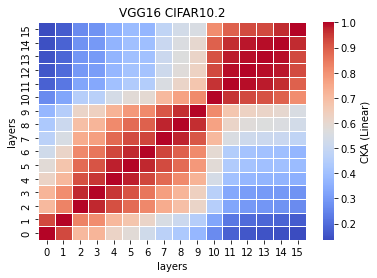

rbf:

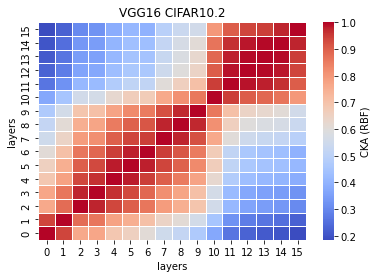

- **vgg12 10% **
```
ood_features2_x = {
avg_time: 7.2571
std_time: 0.1758
avg_acc: 0.5637
std_acc: 0.0052
}
```

```
Test average loss: 5.0388, acc: 0.5690
Test time: 7.3186 s
----------
Test average loss: 4.8026, acc: 0.5670
Test time: 7.0941 s
----------
Test average loss: 3.9518, acc: 0.5550
Test time: 7.2570 s
----------
Test average loss: 5.1057, acc: 0.5670
Test time: 7.0641 s
----------
Test average loss: 4.7684, acc: 0.5605
Test time: 7.5519 s
----------
```
linear:<br>
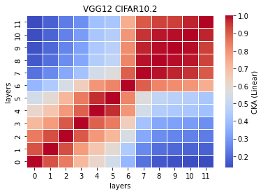<br>
rbf:<br>
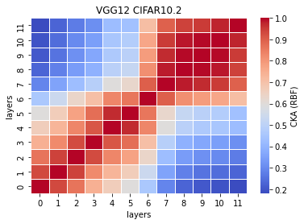<br>

- **vgg11 18%**
```
ood_features3_x = {
avg_time: 8.1673
std_time: 1.2345
avg_acc: 0.5592
std_acc: 0.0055
}
```

```
Test average loss: 4.8428, acc: 0.5550
Test time: 7.0643 s
----------
Test average loss: 5.3311, acc: 0.5635
Test time: 8.9313 s
----------
Test average loss: 4.4372, acc: 0.5595
Test time: 10.1848 s
----------
Test average loss: 4.5807, acc: 0.5515
Test time: 7.7423 s
----------
Test average loss: 4.9220, acc: 0.5665
Test time: 6.9139 s
----------
```

linear:<br>
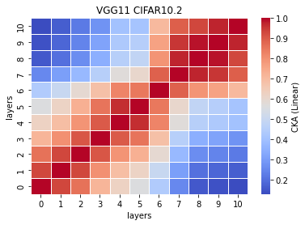<br>
rbf:<br>
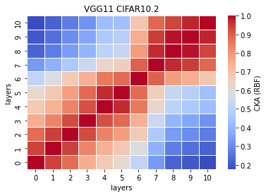<br>

- **vgg10 18%**
```
ood_features4_x = {
avg_time: 7.4639
std_time: 0.6864
avg_acc: 0.5858
std_acc: 0.0085
}
```

```
Test average loss: 4.6810, acc: 0.5825
Test time: 7.2148 s
----------
Test average loss: 4.5164, acc: 0.6015
Test time: 8.8070 s
----------
Test average loss: 4.7156, acc: 0.5870
Test time: 7.0276 s
----------
Test average loss: 4.9977, acc: 0.5765
Test time: 7.3384 s
----------
Test average loss: 4.5443, acc: 0.5815
Test time: 6.9315 s
----------
```
linear:<br>
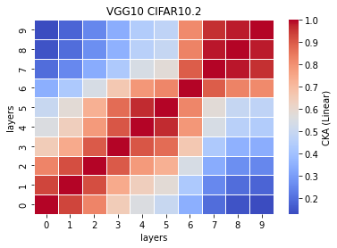<br>
rbf:<br>
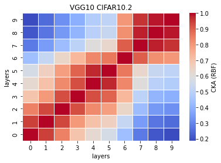<br>

- **vgg9 18%**
```
ood_features5_x = {
avg_time: 6.1032
std_time: 0.6546
avg_acc: 0.5694
std_acc: 0.0149
}
```

```
Test average loss: 4.5706, acc: 0.5910
Test time: 5.7275 s
----------
Test average loss: 2.6517, acc: 0.5455
Test time: 5.7552 s
----------
Test average loss: 1.9383, acc: 0.5690
Test time: 7.4108 s
----------
Test average loss: 1.9475, acc: 0.5765
Test time: 5.7978 s
----------
Test average loss: 1.9750, acc: 0.5650
Test time: 5.8249 s
----------
```
linear:<br>
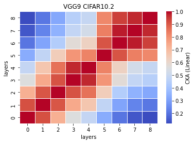<br>
rbf:<br>
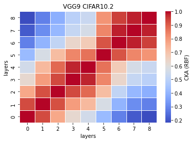<br>

- **vgg6a 20%**
```
ood_features10_x = {
avg_time: 4.6955
std_time: 0.1304
avg_acc: 0.5569
std_acc: 0.0100
}
```

```
Test average loss: 4.0145, acc: 0.5735
Test time: 4.8490 s
----------
Test average loss: 2.2227, acc: 0.5490
Test time: 4.7655 s
----------
Test average loss: 2.1833, acc: 0.5525
Test time: 4.6741 s
----------
Test average loss: 2.4267, acc: 0.5465
Test time: 4.7036 s
----------
Test average loss: 2.1412, acc: 0.5630
Test time: 4.7852 s
----------
```

linear:<br>
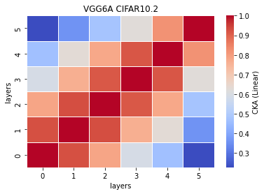<br>
rbf:<br>
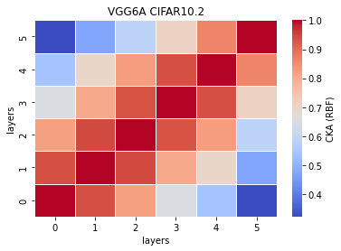<br>

- **vgg8 25%**
```
ood_features6_x = {
avg_time: 4.9382
std_time: 0.0773
avg_acc: 0.5663
std_acc: 0.0138
}
```

```
Test average loss: 4.6201, acc: 0.5835
Test time: 5.0377 s
----------
Test average loss: 1.9310, acc: 0.5705
Test time: 4.9593 s
----------
Test average loss: 2.0288, acc: 0.5455
Test time: 4.9338 s
----------
Test average loss: 1.9028, acc: 0.5760
Test time: 4.9597 s
----------
Test average loss: 1.9252, acc: 0.5560
Test time: 4.8003 s
----------
```
linear:<br>
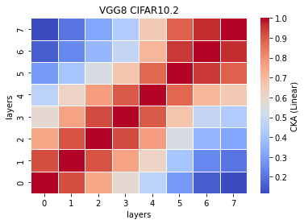<br>
rbf:<br>
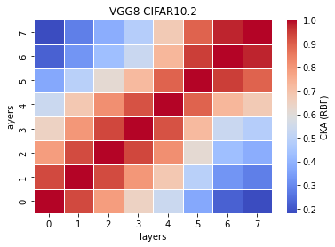<br>

- **vgg7 32%**
```
ood_features7_x = {
avg_time: 4.7662
std_time: 0.1216
avg_acc: 0.5588
std_acc: 0.0104
}
```

```
Test average loss: 4.1930, acc: 0.5790
Test time: 4.9988 s
----------
Test average loss: 2.1272, acc: 0.5550
Test time: 4.7666 s
----------
Test average loss: 1.9820, acc: 0.5565
Test time: 4.7101 s
----------
Test average loss: 2.0831, acc: 0.5545
Test time: 4.7007 s
----------
Test average loss: 2.0849, acc: 0.5490
Test time: 4.6547 s
----------
```
linear:<br>
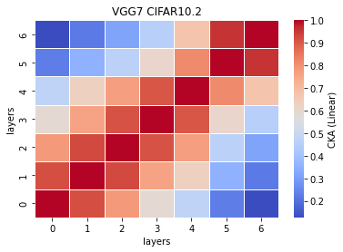<br>
rbf:<br>
<br>

- **vgg15 49%**
```
ood_features11_x = {
avg_time: 9.7029
std_time: 0.2829
avg_acc: 0.5632
std_acc: 0.0123
}
```

```
Test average loss: 3.0109, acc: 0.5755
Test time: 9.5158 s
----------
Test average loss: 2.2123, acc: 0.5715
Test time: 9.4785 s
----------
Test average loss: 2.5554, acc: 0.5670
Test time: 9.9171 s
----------
Test average loss: 2.6454, acc: 0.5405
Test time: 9.4485 s
----------
Test average loss: 2.5506, acc: 0.5615
Test time: 10.1548 s
----------
```
linear:<br>
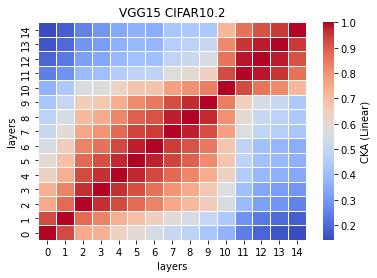<br>
rbf:<br>
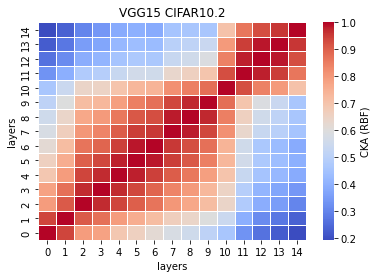<br>

- **vgg14 50%**
```
ood_features12_x = {
avg_time: 9.0484
std_time: 0.9407
avg_acc: 0.5709
std_acc: 0.0080
}
```

```
Test average loss: 2.2801, acc: 0.5780
Test time: 10.9236 s
----------
Test average loss: 2.2034, acc: 0.5575
Test time: 8.6871 s
----------
Test average loss: 1.9027, acc: 0.5700
Test time: 8.4495 s
----------
Test average loss: 1.8298, acc: 0.5690
Test time: 8.6006 s
----------
Test average loss: 1.9273, acc: 0.5800
Test time: 8.5812 s
----------
```
linear:<br>
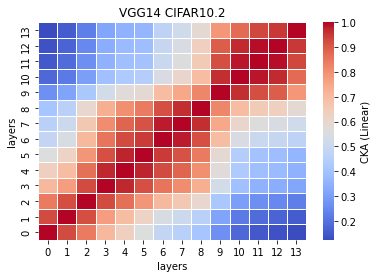<br>
rbf:<br>
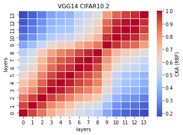<br>

- **vgg13 57%**
```
ood_features13_x = {
avg_time: 
std_time: 
avg_acc: 
std_acc: 
}
```

```

```

linear:<br>
<br>
rbf:<br>
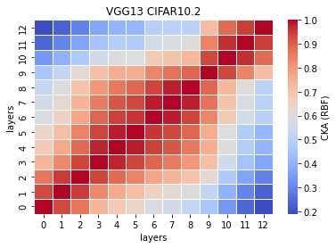<br>

- vgg12a 59%

linear:

rbf:

- vgg11a 66%

linear:

rbf:

- vgg8a 75%

linear:

rbf:

- vgg6 82%

linear:

rbf:

- vgg5 89%

OOD_features9_1
```
Test average loss: 13.6125, acc: 0.1010
Test time: 3.8723 s
----------
```

linear:

rbf:
