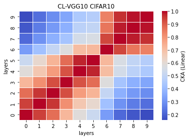
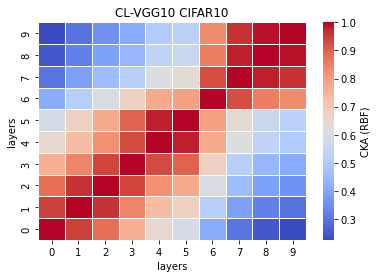

# vgg10
acc = [0.7328, 0.7406, 0.7362, 0.7301, 0.7316] mean:0.7343 std: 0.0038

remained: 10087745

CL_train_model10_x
```
10_1
Train loss: 0.169043, Valid loss: 0.469490
Updating model file...
Early stopping at: 9
----------------------------------------------
10_2
Train loss: 0.360310, Valid loss: 0.478269
Updating model file...
Early stopping at: 7
----------------------------------------------
10_3
Train loss: 0.228115, Valid loss: 0.449656
Updating model file...
Early stopping at: 8
----------------------------------------------
10_4
Train loss: 0.236748, Valid loss: 0.490628
Updating model file...
Early stopping at: 8
----------------------------------------------
10_5
Train loss: 0.225017, Valid loss: 0.455208
Updating model file...
Early stopping at: 8
----------------------------------------------
```

CL_features10_x
```
10_1
Test average loss: 1.5641, acc: 0.7328
----------
10_2
Test average loss: 1.2354, acc: 0.7406
----------
10_3
Test average loss: 1.4532, acc: 0.7362
----------
10_4
Test average loss: 1.4978, acc: 0.7301
----------
10_5
Test average loss: 1.4803, acc: 0.7316
----------
```

linear:



rbf:


