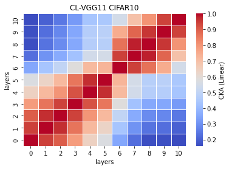
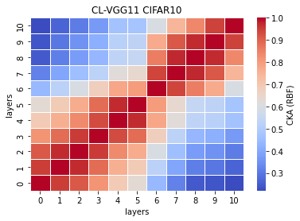

# vgg11

remained: 10087744

acc = [0.7223, 0.7285, 0.7256, 0.7208, 0.7265] mean:0.7247 std: 0.0028

CL_train_model11_x
```
11_1
Train loss: 0.290201, Valid loss: 0.474105
Updating model file...
Early stopping at: 7
----------------------------------------------
11_2
Train loss: 0.196183, Valid loss: 0.480562
Updating model file...
Early stopping at: 8
----------------------------------------------
11_3
Train loss: 0.210741, Valid loss: 0.464792
Updating model file...
Early stopping at: 8
----------------------------------------------
11_4
Train loss: 0.256494, Valid loss: 0.479731
Updating model file...
Early stopping at: 7
----------------------------------------------
11_5
Train loss: 0.190100, Valid loss: 0.476037
Updating model file...
Early stopping at: 8
----------------------------------------------
```

CL_features11_x
```
11_1
Test average loss: 1.5123, acc: 0.7223
----------
11_2
Test average loss: 1.5994, acc: 0.7285
----------
11_3
Test average loss: 1.5791, acc: 0.7256
----------
11_4
Test average loss: 1.5611, acc: 0.7208
----------
11_5
Test average loss: 1.6183, acc: 0.7265
----------
```

linear avg<br>



rbf avg<br>

