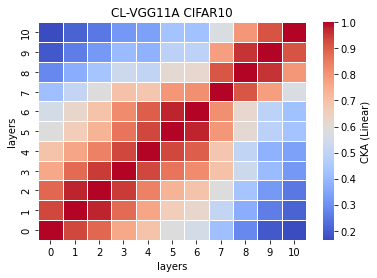
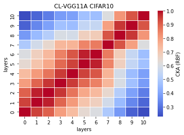

# vgg11a
acc = [0.7119, 0.7135, 0.7115, 0.7180, ] mean: std:

time = [, , 86.2338, 68.1300, ] mean: std:

remained:

CL_features11a_x
```
11a_1
Test average loss: 1.5041, acc: 0.7119
----------
11a_2
Test average loss: 1.4017, acc: 0.7135
----------
11a_3
Test average loss: 1.2197, acc: 0.7115
----------
11a_4
Test average loss: 1.4044, acc: 0.7180
----------
11a_5

```

CL_train_model11a_x
```
11a_1
Train loss: 0.292942, Valid loss: 0.610811
Updating model file...
Early stopping at: 10
----------------------------------------------
11a_2
Train loss: 0.394346, Valid loss: 0.560341
Updating model file...
Early stopping at: 8
----------------------------------------------
11a_3
Train loss: 0.508614, Valid loss: 0.625474
Updating model file...
Early stopping at: 7
----------------------------------------------
11a_4
---
11a_5

```

linear:



rbf:


