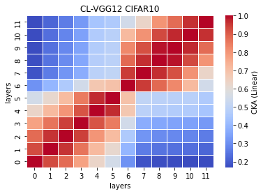
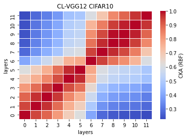

# CKA LTH VGG12
| prune % | acc. |
|---------|------|
|    10   |   0.6959   |
|    20     |      |
|         |      |

remained params: 30263207

CL_train_model1_x
```
1_1

1_2

1_3

1_4

1_5

```

CL_features1_x
```
1_1

1_2

1_3

1_4

1_5

```

CKA Linear avg: <br>


CKA RBF avg: <br>

