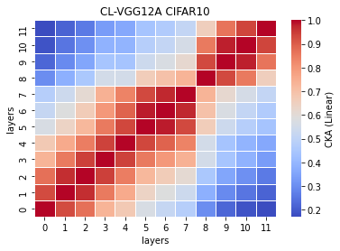
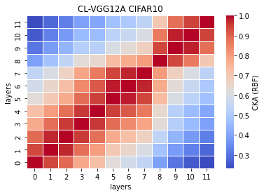

# vgg12a
acc = [0.7311, 0.7338, 0.7283, 0.7303, ] mean: std:

remained:

CL_features12a_x
```
12a_1
Test average loss: 1.2570, acc: 0.7311
----------
12a_2
Test average loss: 1.1999, acc: 0.7338
----------
12a_3
Test average loss: 1.1521, acc: 0.7283
----------
12a_4
Test average loss: 1.0611, acc: 0.7303
----------
12a_5

```

CL_train_model12a_x
```
12a_1
Train loss: 0.355315, Valid loss: 0.616033
Updating model file...
Early stopping at: 12
----------------------------------------------
12a_2
Train loss: 0.361394, Valid loss: 0.581758
Updating model file...
Early stopping at: 11
----------------------------------------------
12a_3
Train loss: 0.412727, Valid loss: 0.611548
Updating model file...
Early stopping at: 11
----------------------------------------------
12a_4
Train loss: 0.481748, Valid loss: 0.609573
Updating model file...
Early stopping at: 10
----------------------------------------------
12a_5

```


linear:



rbf:


