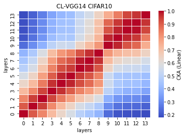
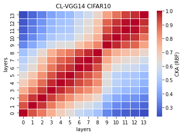

# vgg14
acc. = [0.7406, 0.7450, 0.7417, ] mean: std: 

remained:

CL_features14_x
```
14_1
Test average loss: 1.1456, acc: 0.7406
----------
14_2
Test average loss: 1.1022, acc: 0.7450
----------
14_3
Test average loss: 0.9529, acc: 0.7417
----------
14_4

14_5

```

CL_train_model14_x
```
14_1
Train loss: 0.356717, Valid loss: 0.567602
Updating model file...
Early stopping at: 13
----------------------------------------------
14_2
Train loss: 0.320815, Valid loss: 0.587903
Updating model file...
Early stopping at: 14
----------------------------------------------
14_3
Train loss: 0.463694, Valid loss: 0.612858
Updating model file...
Early stopping at: 12
----------------------------------------------
14_4

14_5

```

linear:



rbf:


