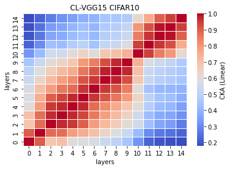
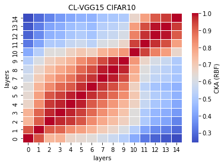

# vgg15
acc. = [0.7322, 0.7084, 0.7321, 0.7148, ] mean: std: 

remained: 10087745

CL_features15_x
```
15_1
Test average loss: 1.4059, acc: 0.7322
----------
15_2
Test average loss: 1.3299, acc: 0.7084
----------
15_3
Test average loss: 1.3326, acc: 0.7321
----------
15_4
Test average loss: 1.2940, acc: 0.7148
----------
15_5

```

CL_train_model15_x
```
15_1
Train loss: 0.302589, Valid loss: 0.522826
Updating model file...
Early stopping at: 13
----------------------------------------------
15_2
Train loss: 0.367469, Valid loss: 0.600725
Updating model file...
Early stopping at: 14
----------------------------------------------
15_3
Train loss: 0.371848, Valid loss: 0.565476
Updating model file...
Early stopping at: 13
----------------------------------------------
15_4
Train loss: 0.424411, Valid loss: 0.603898
Updating model file...
Early stopping at: 12
----------------------------------------------
15_5

```

linear:



rbf:


