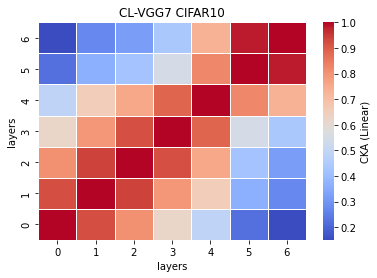
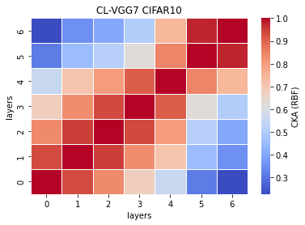

# vgg7
acc = [0.7358, 0.7326, 0.7233, ] mean: std:

remained: 10087744

CL_features7_x
```
7_1
Test average loss: 1.3430, acc: 0.7358
----------
7_2
Test average loss: 1.1291, acc: 0.7326
----------
7_3
Test average loss: 1.0073, acc: 0.7233
----------
7_4

7_5

```

CL_train_model7_x
```
7_1
Train loss: 0.128643, Valid loss: 0.507068
Updating model file...
Early stopping at: 14
----------------------------------------------
7_2
Train loss: 0.270092, Valid loss: 0.549495
Updating model file...
Early stopping at: 13
----------------------------------------------
7_3
Train loss: 0.410387, Valid loss: 0.562823
Updating model file...
Early stopping at: 10
----------------------------------------------
7_4

7_5

```

linear:



rbf:


