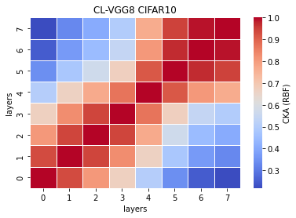

# vgg8
acc = [0.7343, 0.7156, ] mean: std:

remained: 10087743

CL_train_model8_x
```
8_1
Train loss: 0.184199, Valid loss: 0.469478
Updating model file...
Early stopping at: 11
----------------------------------------------
8_2
Train loss: 0.416008, Valid loss: 0.589759
Updating model file...
Early stopping at: 10
----------------------------------------------
8_3

8_4

8_5

```

CL_features8_x
```
8_1
Test average loss: 1.3333, acc: 0.7343
----------
8_2
Test average loss: 1.0907, acc: 0.7156
----------
8_3

8_4

8_5

```

linear:


rbf:


