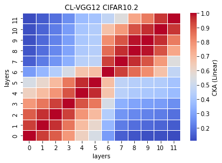
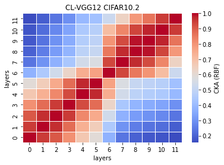
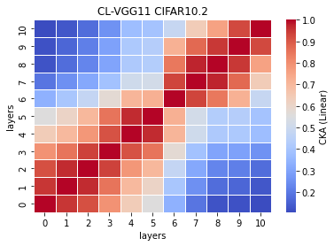
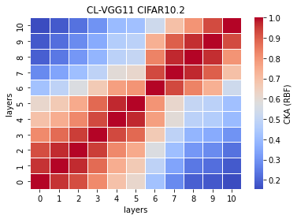
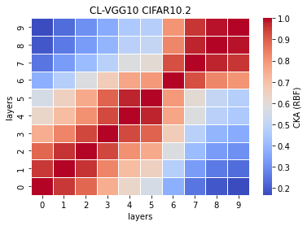
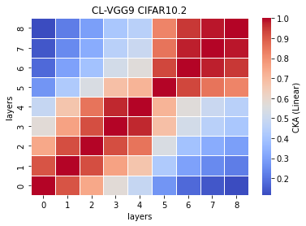
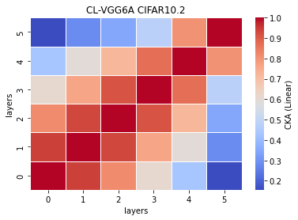
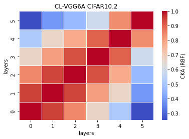

# CL OOD
vgg12
```
avg acc: 
std acc: 
avg time: 
std time: 
```
12_x
```
Test average loss: 3.2163, acc: 0.5620
Test time: 7.4619 s
----------
Test average loss: 3.4851, acc: 0.5495
Test time: 7.3119 s
----------
Test average loss: 3.5564, acc: 0.5630
Test time: 7.2773 s
----------
Test average loss: 2.9365, acc: 0.5415
Test time: 7.3627 s
----------
Test average loss: 3.4702, acc: 0.5645
Test time: 7.2455 s
----------
```
linear<br>
<br>
rbf<br>
<br>

vgg11
```
avg acc: 
std acc: 
avg time: 
std time: 
```
11_x
```
Test average loss: 3.1841, acc: 0.5505
Test time: 7.0047 s
----------
Test average loss: 3.3747, acc: 0.5625
Test time: 8.5976 s
----------
Test average loss: 3.3166, acc: 0.5610
Test time: 7.1005 s
----------
Test average loss: 3.1648, acc: 0.5650
Test time: 7.3086 s
----------
Test average loss: 3.4317, acc: 0.5725
Test time: 7.0086 s
----------
```
linear<br>
<br>
rbf<br>
<br>

vgg10
```
avg acc: 
std acc: 
avg time: 
std time: 
```
10_x
```
Test average loss: 3.1969, acc: 0.5730
Test time: 10.1990 s
----------
Test average loss: 2.4042, acc: 0.5830
Test time: 7.2239 s
----------
Test average loss: 2.9483, acc: 0.5825
Test time: 7.2417 s
----------
Test average loss: 3.1569, acc: 0.5670
Test time: 7.2932 s
----------
Test average loss: 3.0752, acc: 0.5775
Test time: 7.1690 s
----------
```
linear<br>
<br>
rbf<br>
<br>

vgg9
```
avg acc: 
std acc: 
avg time: 
std time: 
```
9_x
```
Test average loss: 2.7259, acc: 0.5760
Test time: 7.7355 s
----------
Test average loss: 2.6806, acc: 0.5855
Test time: 5.9277 s
----------
Test average loss: 1.9096, acc: 0.5825
Test time: 5.8633 s
----------
Test average loss: 2.0996, acc: 0.5720
Test time: 5.8402 s
----------
Test average loss: 2.1149, acc: 0.5715
Test time: 6.0196 s
----------
```
linear<br>
<br>
rbf<br>
<br>

vgg6a
```
avg acc: 
std acc: 
avg time: 
std time: 
```
6a_x
```
Test average loss: 2.2371, acc: 0.5670
Test time: 4.7885 s
----------
Test average loss: 2.2078, acc: 0.5615
Test time: 4.8816 s
----------
Test average loss: 2.0330, acc: 0.5700
Test time: 4.8169 s
----------
Test average loss: 2.1277, acc: 0.5575
Test time: 4.8399 s
----------
Test average loss: 2.3248, acc: 0.5675
Test time: 4.7318 s
----------
```
linear<br>
<br>
rbf<br>
<br>

vgg8
```
avg acc: 
std acc: 
avg time: 
std time: 
```
8_x
```
Test average loss: 2.7423, acc: 0.5725
Test time: 5.1387 s
----------

```
linear<br>
<br>
rbf<br>
<br>

vgg7
```
avg acc: 
std acc: 
avg time: 
std time: 
```
_x
```
```
linear<br>
<br>
rbf<br>
<br>

vgg15
```
avg acc: 
std acc: 
avg time: 
std time: 
```
_x
```
```
linear<br>
<br>
rbf<br>
<br>

vgg14
```
avg acc: 
std acc: 
avg time: 
std time: 
```
_x
```
```
linear<br>
<br>
rbf<br>
<br>

vgg13
```
avg acc: 
std acc: 
avg time: 
std time: 
```
_x
```
```
linear<br>
<br>
rbf<br>
<br>

vgg12a
```
avg acc: 
std acc: 
avg time: 
std time: 
```
_x
```
```
linear<br>
<br>
rbf<br>
<br>

vgg11a
```
avg acc: 
std acc: 
avg time: 
std time: 
```
_x
```
```
linear<br>
<br>
rbf<br>
<br>

vgg8a
```
avg acc: 
std acc: 
avg time: 
std time: 
```
_x
```
```
linear<br>
<br>
rbf<br>
<br>

vgg6
```
avg acc: 
std acc: 
avg time: 
std time: 
```
_x
```
```
linear<br>
<br>
rbf<br>
<br>

vgg5
```
avg acc: 
std acc: 
avg time: 
std time: 
```
_x
```
```
linear<br>
<br>
rbf<br>
<br>
