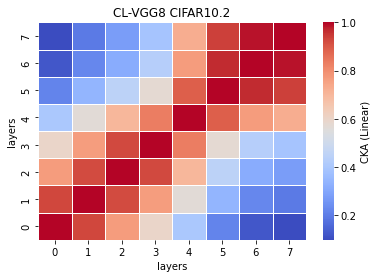
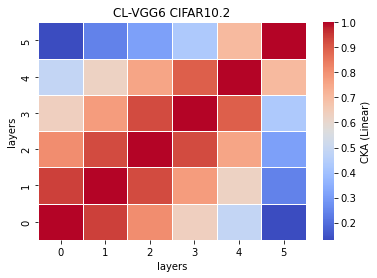

# CL OOD
vgg12
```
avg acc: 0.562
std acc: 0.0091
avg time: 7.3319
std time: 0.0758
```
12_x
```
Test average loss: 3.2163, acc: 0.5620
Test time: 7.4619 s
----------
Test average loss: 3.4851, acc: 0.5495
Test time: 7.3119 s
----------
Test average loss: 3.5564, acc: 0.5630
Test time: 7.2773 s
----------
Test average loss: 2.9365, acc: 0.5415
Test time: 7.3627 s
----------
Test average loss: 3.4702, acc: 0.5645
Test time: 7.2455 s
----------
```
linear<br>
<br>
rbf<br>
<br>

vgg11
```
avg acc: 0.5623
std acc: 0.0071
avg time: 7.4040
std time: 0.6069
```
11_x
```
Test average loss: 3.1841, acc: 0.5505
Test time: 7.0047 s
----------
Test average loss: 3.3747, acc: 0.5625
Test time: 8.5976 s
----------
Test average loss: 3.3166, acc: 0.5610
Test time: 7.1005 s
----------
Test average loss: 3.1648, acc: 0.5650
Test time: 7.3086 s
----------
Test average loss: 3.4317, acc: 0.5725
Test time: 7.0086 s
----------
```
linear<br>
<br>
rbf<br>
<br>

vgg10
```
avg acc: 0.5766
std acc: 0.0060
avg time: 7.8254
std time: 1.1875
```
10_x
```
Test average loss: 3.1969, acc: 0.5730
Test time: 10.1990 s
----------
Test average loss: 2.4042, acc: 0.5830
Test time: 7.2239 s
----------
Test average loss: 2.9483, acc: 0.5825
Test time: 7.2417 s
----------
Test average loss: 3.1569, acc: 0.5670
Test time: 7.2932 s
----------
Test average loss: 3.0752, acc: 0.5775
Test time: 7.1690 s
----------
```
linear<br>
<br>
rbf<br>
<br>

vgg9
```
avg acc: 0.5775
std acc: 0.0056
avg time: 6.2773
std time: 0.7318
```
9_x
```
Test average loss: 2.7259, acc: 0.5760
Test time: 7.7355 s
----------
Test average loss: 2.6806, acc: 0.5855
Test time: 5.9277 s
----------
Test average loss: 1.9096, acc: 0.5825
Test time: 5.8633 s
----------
Test average loss: 2.0996, acc: 0.5720
Test time: 5.8402 s
----------
Test average loss: 2.1149, acc: 0.5715
Test time: 6.0196 s
----------
```
linear<br>
<br>
rbf<br>
<br>

vgg6a
```
avg acc: 0.5647
std acc: 0.0045
avg time: 4.8117
std time: 0.0503
```
6a_x
```
Test average loss: 2.2371, acc: 0.5670
Test time: 4.7885 s
----------
Test average loss: 2.2078, acc: 0.5615
Test time: 4.8816 s
----------
Test average loss: 2.0330, acc: 0.5700
Test time: 4.8169 s
----------
Test average loss: 2.1277, acc: 0.5575
Test time: 4.8399 s
----------
Test average loss: 2.3248, acc: 0.5675
Test time: 4.7318 s
----------
```
linear<br>
<br>
rbf<br>
<br>

vgg8
```
avg acc: 0.5687
std acc: 0.0085
avg time: 5.3320
std time: 0.1278
```
8_x
```
Test average loss: 2.7423, acc: 0.5725
Test time: 5.1387 s
----------
Test average loss: 2.2478, acc: 0.5570
Test time: 5.4791 s
----------
Test average loss: 2.4209, acc: 0.5705
Test time: 5.4640 s
----------
Test average loss: 2.2905, acc: 0.5620
Test time: 5.2617 s
----------
Test average loss: 2.0403, acc: 0.5815
Test time: 5.3167 s
----------
```
linear<br>
<br>
rbf<br>
<br>

vgg7
```
avg acc: 0.5629
std acc: 0.0053
avg time: 4.9639
std time: 0.1259
```
7_x
```
Test average loss: 2.8164, acc: 0.5620
Test time: 5.1358 s
----------
Test average loss: 2.4218, acc: 0.5575
Test time: 4.8857 s
----------
Test average loss: 2.0305, acc: 0.5585
Test time: 4.9602 s
----------
Test average loss: 2.3332, acc: 0.5640
Test time: 5.0596 s
----------
Test average loss: 2.1108, acc: 0.5725
Test time: 4.7784 s
----------
```
linear<br>
<br>
rbf<br>
<br>

vgg15
```
avg acc: 0.5549
std acc: 0.0089
avg time: 9.8972
std time: 0.2395
```
15_x
```
Test average loss: 2.8337, acc: 0.5630
Test time: 10.2504 s
----------
Test average loss: 2.7323, acc: 0.5405
Test time: 9.7777 s
----------
Test average loss: 2.6090, acc: 0.5650
Test time: 10.0996 s
----------
Test average loss: 2.4989, acc: 0.5505
Test time: 9.6026 s
----------
Test average loss: 2.6309, acc: 0.5555
Test time: 9.7559 s
----------
```
linear<br>
<br>
rbf<br>
<br>

vgg14
```
avg acc: 0.5921
std acc: 0.0042
avg time: 10.0713
std time: 1.3933
```
14_x
```
Test average loss: 2.2687, acc: 0.5995
Test time: 11.3041 s
----------
Test average loss: 2.2924, acc: 0.5885
Test time: 12.1743 s
----------
Test average loss: 1.8716, acc: 0.5880
Test time: 9.1481 s
----------
Test average loss: 1.9670, acc: 0.5910
Test time: 8.8382 s
----------
Test average loss: 1.9534, acc: 0.5935
Test time: 8.8916 s
----------
```
linear<br>
<br>
rbf<br>
<br>

vgg13
```
avg acc: 0.5733
std acc: 0.0102
avg time: 9.6086
std time: 1.4049
```
13_x
```
Test average loss: 2.2266, acc: 0.5755
Test time: 11.8866 s
----------
Test average loss: 2.5173, acc: 0.5570
Test time: 10.6240 s
----------
Test average loss: 2.3454, acc: 0.5870
Test time: 8.5589 s
----------
Test average loss: 2.3607, acc: 0.5790
Test time: 8.3651 s
----------
Test average loss: 2.1651, acc: 0.5680
Test time: 8.6083 s
----------
```
linear<br>
<br>
rbf<br>
<br>

vgg12a
```
avg acc: 0.5675
std acc: 0.0049
avg time: 7.6633
std time: 0.1005
```
12a_x
```
Test average loss: 2.5409, acc: 0.5700
Test time: 7.8361 s
----------
Test average loss: 2.4936, acc: 0.5655
Test time: 7.5741 s
----------
Test average loss: 2.3781, acc: 0.5610
Test time: 7.5579 s
----------
Test average loss: 2.0949, acc: 0.5655
Test time: 7.6487 s
----------
Test average loss: 1.9523, acc: 0.5755
Test time: 7.6997 s
----------
```
linear<br>
<br>
rbf<br>
<br>

vgg11a
```
avg acc: 0.5456
std acc: 0.0058
avg time: 7.5563
std time: 0.8672
```
11a_x
```
Test average loss: 3.1700, acc: 0.5475
Test time: 9.2688 s
----------
Test average loss: 2.9748, acc: 0.5380
Test time: 7.2114 s
----------
Test average loss: 2.3677, acc: 0.5510
Test time: 7.3365 s
----------
Test average loss: 2.8494, acc: 0.5520
Test time: 6.9600 s
----------
Test average loss: 2.8565, acc: 0.5395
Test time: 7.0046 s
----------
```
linear<br>
<br>
rbf<br>
<br>

vgg8a
```
avg acc: 0.5627
std acc: 0.0106
avg time: 4.3501
std time: 0.5976
```
8a_x
```
Test average loss: 2.2504, acc: 0.5610
Test time: 5.5286 s
----------
Test average loss: 2.7890, acc: 0.5755
Test time: 3.9144 s
----------
Test average loss: 2.2464, acc: 0.5540
Test time: 4.2148 s
----------
Test average loss: 2.1591, acc: 0.5740
Test time: 4.0028 s
----------
Test average loss: 2.1315, acc: 0.5490
Test time: 4.0898 s
----------
```
linear<br>
<br>
rbf<br>
<br>

vgg6
```
avg acc: 0.5557
std acc: 0.0061
avg time: 3.9221
std time: 0.0823
```
6_x
```
Test average loss: 2.5172, acc: 0.5475
Test time: 4.0001 s
----------
Test average loss: 2.3513, acc: 0.5530
Test time: 3.8803 s
----------
Test average loss: 2.0023, acc: 0.5615
Test time: 4.0318 s
----------
Test average loss: 1.8625, acc: 0.5640
Test time: 3.8080 s
----------
Test average loss: 2.3504, acc: 0.5525
Test time: 3.8903 s
----------
```
linear<br>
<br>
rbf<br>
<br>

vgg5
```
avg acc: 0.5642
std acc: 0.0068
avg time: 3.9259
std time: 0.0965
```
5_x
```
Test average loss: 2.2038, acc: 0.5600
Test time: 3.9785 s
----------
Test average loss: 1.9777, acc: 0.5595
Test time: 3.8673 s
----------
Test average loss: 1.9479, acc: 0.5635
Test time: 4.0918 s
----------
Test average loss: 1.9826, acc: 0.5605
Test time: 3.8419 s
----------
Test average loss: 1.9755, acc: 0.5775
Test time: 3.8499 s
----------
```
linear<br>
<br>
rbf<br>
<br>
