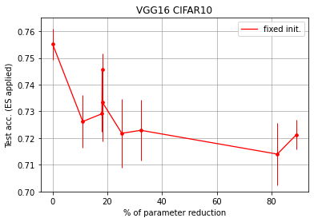
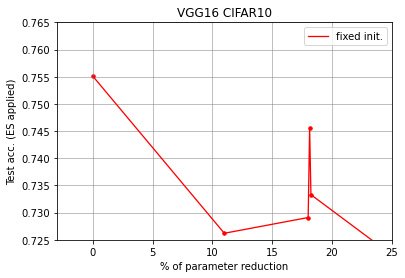

## current observations
LTH的architecture并没有改变，这导致相较于VGG16：
1. memory 不变；
2. 不同layer的weights no grad

问题： no_grad和mask的区别和对其他weights的影响？(math part, backpropagation)

新实验：
1. 如果不删除layer，而是initialize以后根据CKA similarity限制整个layer no_grad()呢？
2. 还是不删除layer，只对high CKA similarity的layer进行LTH操作？

how are models performance on cifar10 with shortcuts. identifying etc.

- max pooling layer is important
    - exp: deduce which layers contain max_pool in raw VGG16 can be deducted, see what happens if reduce layers with max_pool (control number of layers or params equivalent)
- fixed initialization: try not fixed initialization. 
- based on ablation study, shall draw acc vs. % of parameters reduction and acc vs. num of layers.

Based on the plot: 
 and  
  

我们减少了4，5个conv layers（VGG12, VGG11），mean acc 表现出了明显的下降；在额外减少了一个fc之后(VGG10)，mean acc表现出了明显的上升，这是否说明有以下两个hypothesis：
- conv grabs information?
- fc distort learned information?

其他实验现象似乎也满足这两个hypothesis：
- 在VGG10的基础上再减少1，2个conv layers(VGG9, VGG8)，mean acc下降；
- 再减少一个conv layer（VGG7），mean acc slightly increases（不符合hypothesis）；
- 
