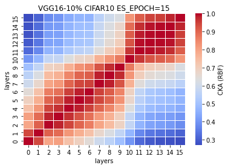
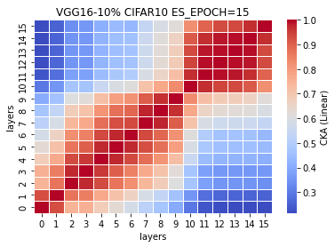
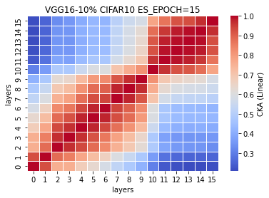

# LTH remove 10% params on VGG16

acc = [0.7574, ]

remaining params.: 30263206 <br>
removed: 33625792 - 30263206 = 3362586 = 10%

LTH_train_model1_x
```
1_1
Train loss: 0.405162, Valid loss: 0.741360
Updating model file...
Early stopping at: 16
----------------------------------------------
1_2
Train loss: 0.493147, Valid loss: 0.730518
Updating model file...
Early stopping at: 15
----------------------------------------------
1_3
Train loss: 0.477625, Valid loss: 0.745785
Updating model file...
Early stopping at: 15
----------------------------------------------
1_4

```

LTH_features1_x.pt
```
1_1
Test average loss: 1.5805, acc: 0.7574
----------
1_2
Test average loss: 1.5377, acc: 0.7638
----------
1_3

```

similarity plots: <br>
1_1<br>
 <br>
1_2<br>
 <br>
1_3<br>
 <br>

