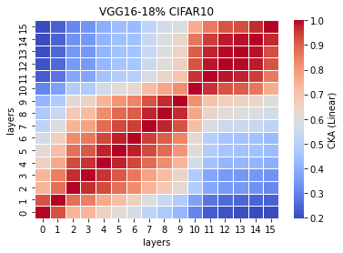
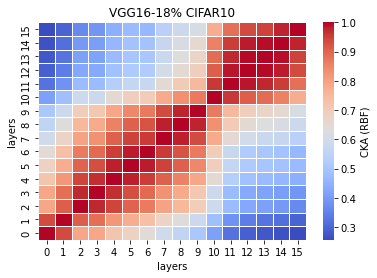

# LTH remove 18% params on VGG16

acc. = [0.7537, 0.7439, 0.7378, 0.7567, 0.7469] mean: 0.7478 std: 0.0068

remain params. : 33625792 - 27573144 = 6052648<br>
percent: 6052648/33625792\*100=18.00001<br>

LTH_train2_x
```
2_1
Train loss: 0.438513, Valid loss: 0.666872
Updating model file...
Early stopping at: 11
----------------------------------------------
2_2
Train loss: 0.525457, Valid loss: 0.646072
Updating model file...
Early stopping at: 10
----------------------------------------------
2_3
Train loss: 0.362883, Valid loss: 0.754015
Updating model file...
Early stopping at: 17
----------------------------------------------
2_4
Train loss: 0.367676, Valid loss: 0.636598
Updating model file...
Early stopping at: 12
----------------------------------------------
2_5
Train loss: 0.444199, Valid loss: 0.643719
Updating model file...
Early stopping at: 11
----------------------------------------------
```

LTH_features2_x.pt
```
2_1
Test average loss: 1.2802, acc: 0.7537
----------
2_2
Test average loss: 1.2388, acc: 0.7439
----------
2_3
Test average loss: 1.1103, acc: 0.7378
----------
2_4
Test average loss: 1.2313, acc: 0.7567
----------
2_5
Test average loss: 1.2141, acc: 0.7469
----------
```

CKA Linear plot (averaged over 5 exps): <br>


CKA RBF plot (averaged over 5 exps): <br>

