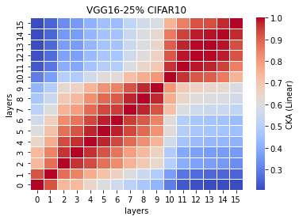
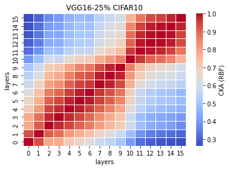

# LTH remove 25% params on VGG16
acc. = [0.7576, 0.7550, 0.7503, 0.7461, 0.7498]

remain params: 25219344<br>
percentage: <br>

LTH_train3_x
```
3_1
Train loss: 0.398886, Valid loss: 0.584499
Updating model file...
Early stopping at: 9
----------------------------------------------
3_2
Train loss: 0.401528, Valid loss: 0.594477
Updating model file...
Early stopping at: 9
----------------------------------------------
3_3
Train loss: 0.235601, Valid loss: 0.593877
Updating model file...
Early stopping at: 11
----------------------------------------------
3_4
Train loss: 0.484188, Valid loss: 0.572024
Updating model file...
Early stopping at: 8
----------------------------------------------
3_5
Train loss: 0.307419, Valid loss: 0.554176
Updating model file...
Early stopping at: 10
----------------------------------------------
```

LTH_features3_x.pt
```
3_1
Test average loss: 1.4295, acc: 0.7396
----------
3_2
Test average loss: 1.1993, acc: 0.7550
----------
3_3
Test average loss: 1.2688, acc: 0.7503
----------
3_4
Test average loss: 1.2248, acc: 0.7461
----------
3_5
Test average loss: 1.2561, acc: 0.7498
----------
```

CKA Linear plot (averaged over 5 exps): <br>


CKA RBF plot (averaged over 5 exps): <br>

