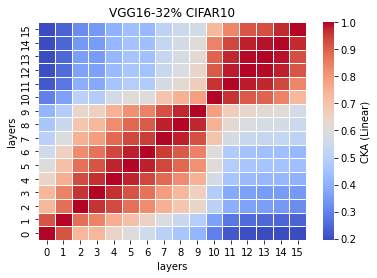
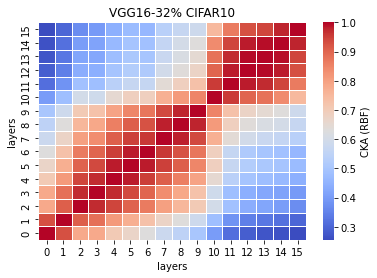

# LTH remove 32% params on VGG16
acc. = [0.7544, 0.7566, 0.7549, 0.7452, 0.7595] mean: 0.7541 std: 0.0048

remain params: 22865536<br>
percentage: <br>

LTH_train4_x
```
4_1
Train loss: 0.308225, Valid loss: 0.538320
Updating model file...
Early stopping at: 8
----------------------------------------------
4_2
Train loss: 0.196730, Valid loss: 0.544074
Updating model file...
Early stopping at: 10
----------------------------------------------
4_3
Train loss: 0.246846, Valid loss: 0.512801
Updating model file...
Early stopping at: 9
----------------------------------------------
4_4
Train loss: 0.257393, Valid loss: 0.528910
Updating model file...
Early stopping at: 9
----------------------------------------------
4_5
Train loss: 0.412021, Valid loss: 0.524788
Updating model file...
Early stopping at: 7
----------------------------------------------
```

LTH_features4_x.pt
```
4_1
Test average loss: 1.2370, acc: 0.7544
----------
4_2
Test average loss: 1.3525, acc: 0.7566
----------
4_3
Test average loss: 1.3163, acc: 0.7549
----------
4_4
Test average loss: 1.3695, acc: 0.7452
----------
4_5
Test average loss: 1.2751, acc: 0.7595
----------
```

CKA Linear plot (averaged over 5 exps): <br>


CKA RBF plot (averaged over 5 exps): <br>

