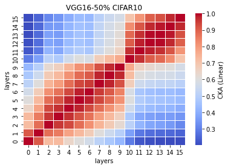
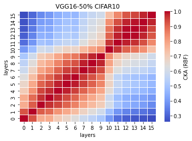

# 50% vgg16
acc = [0.7453, 0.7558, 0.7547, 0.7402, 0.7569] mean:0.7506 std: 0.0066

time: [54.6701, 66.2927, 52.4928, 52.3782, 55.8827] mean:56.3433 std: 5.1488

remained: 16812897

LTH_features50_x
```
50_1
Test average loss: 1.4826, acc: 0.7453
Test time: 54.6701 s
----------
50_2
Test average loss: 1.3233, acc: 0.7558
Test time: 66.2927 s
----------
50_3
Test average loss: 1.2726, acc: 0.7547
Test time: 52.4928 s
----------
50_4
Test average loss: 1.1929, acc: 0.7402
Test time: 52.3782 s
----------
50_5
Test average loss: 1.2850, acc: 0.7569
Test time: 55.8827 s
----------
```

LTH_train_model50_x
```
50_1
Train loss: 0.241824, Valid loss: 0.453130
Updating model file...
Early stopping at: 7
----------------------------------------------
50_2
Train loss: 0.194466, Valid loss: 0.437728
Updating model file...
Early stopping at: 8
----------------------------------------------
50_3
Train loss: 0.190451, Valid loss: 0.442019
Updating model file...
Early stopping at: 8
----------------------------------------------
50_4
Train loss: 0.220351, Valid loss: 0.427867
Updating model file...
Early stopping at: 8
----------------------------------------------
50_5
Train loss: 0.269153, Valid loss: 0.448977
Updating model file...
Early stopping at: 7
----------------------------------------------
```

linear: 



rbf:


