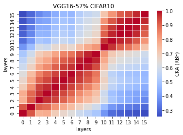

# 57% vgg16
acc = [0.7535, 0.7529, 0.7633, 0.7456, 0.7549, ] mean: std:

time = [58.0886, 53.1111, 53.8387, 55.3955, 54.7396] mean: std:

remained: 14459090

LTH_features57_x
```
57_1
Test average loss: 1.2340, acc: 0.7535
Test time: 58.0886 s
----------
57_2
Test average loss: 1.3657, acc: 0.7529
Test time: 53.1111 s
----------
57_3
Test average loss: 1.2012, acc: 0.7633
Test time: 53.8387 s
----------
57_4
Test average loss: 1.4471, acc: 0.7456
Test time: 55.3955 s
----------
57_5
Test average loss: 1.2210, acc: 0.7549
Test time: 54.7396 s
----------
```

LTH_train_model57_x
```
57_1
Train loss: 0.284035, Valid loss: 0.436246
Updating model file...
Early stopping at: 7
----------------------------------------------
57_2
Train loss: 0.183157, Valid loss: 0.433682
Updating model file...
Early stopping at: 9
----------------------------------------------
57_3
Train loss: 0.329639, Valid loss: 0.469240
Updating model file...
Early stopping at: 7
----------------------------------------------
57_4
Train loss: 0.164953, Valid loss: 0.440593
Updating model file...
Early stopping at: 9
----------------------------------------------
57_5
Train loss: 0.231457, Valid loss: 0.466806
Updating model file...
Early stopping at: 8
----------------------------------------------
```

linear:


rbf:


