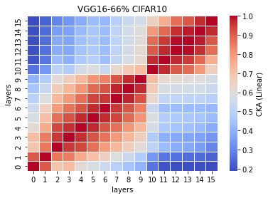

# vgg16 66%
acc = [0.7519, 0.7518, 0.7569, ] mean: std:

time = [58.4802, 57.5566, 64.8435, ] mean: std:

remained: 11432773

LTH_features66_x
```
66_1
Test average loss: 1.2697, acc: 0.7519
Test time: 58.4802 s
----------
66_2
Test average loss: 1.1457, acc: 0.7518
Test time: 57.5566 s
----------
66_3
Test average loss: 1.3298, acc: 0.7569
Test time: 64.8435 s
----------
66_4

66_5

```

LTH_train_model66_x
```
66_1
Train loss: 0.288740, Valid loss: 0.472793
Updating model file...
Early stopping at: 11
----------------------------------------------
66_2
Train loss: 0.331215, Valid loss: 0.463291
Updating model file...
Early stopping at: 11
----------------------------------------------
66_3
Train loss: 0.293432, Valid loss: 0.456397
Updating model file...
Early stopping at: 11
----------------------------------------------
66_4

66_5

```

linear:



rbf:


