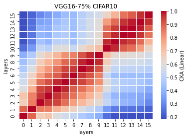
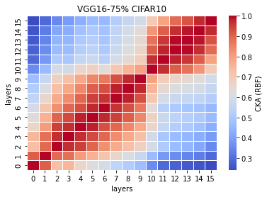

# vgg16 75%
acc = [] mean: std:

time = [] mean: std:

remained: 8406454

LTH_features75_x
```
75_1

75_2

75_3
Test average loss: 1.2552, acc: 0.7545
Test time: 54.1251 s
----------
75_4

75_5

```

LTH_train_model75_x
```
75_1
Train loss: 0.308157, Valid loss: 0.522946
Updating model file...
Early stopping at: 30
----------------------------------------------
75_2

75_3

75_4

75_5

```

linear:



rbf:


