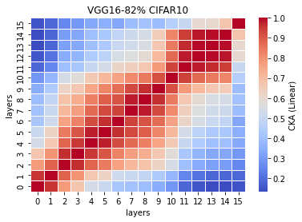

# LTH remove 82% params on VGG16
acc. = [] mean:  std: 0.


remain params: 6052651<br>
percentage: <br>

LTH_features5_x.pt
```
5_1
Test average loss: 0.9594, acc: 0.7045
Test time: 59.8993 s
----------
5_2

5_3

5_4

5_5

```

LTH_train5_x
```
5_1
Train loss: 0.751883, Valid loss: 0.821070
Updating model file...
Early stopping at: 8
----------------------------------------------
5_2

5_3

5_4

5_5

```

CKA Linear plot (averaged over 5 exps): <br>


CKA RBF plot (averaged over 5 exps): <br>


```
5_1
Train loss: 2.302323, Valid loss: 2.302320
Updating model file...
Early stopping at: 100
----------------------------------------------
Train loss: 2.302537, Valid loss: 2.302538
Updating model file...
Early stopping at: 31
----------------------------------------------
5_2
Train loss: 2.302562, Valid loss: 2.302561
Updating model file...
Early stopping at: 20
----------------------------------------------
5_3
Train loss: 2.302548, Valid loss: 2.302548
Updating model file...
Early stopping at: 20
----------------------------------------------
5_4
Train loss: 2.302559, Valid loss: 2.302560
Updating model file...
Early stopping at: 20
----------------------------------------------
5_5
Train loss: 2.302566, Valid loss: 2.302566
Updating model file...
Early stopping at: 20
----------------------------------------------
```

```
5_1
Test average loss: 2.3023, acc: 0.4400
----------
Test average loss: 2.3025, acc: 0.3485
Test time: 59.8367 s
----------
5_2
Test average loss: 2.3026, acc: 0.2301
----------
5_3
Test average loss: 2.3025, acc: 0.2715
----------
5_4
Test average loss: 2.3026, acc: 0.2537
----------
5_5
Test average loss: 2.3026, acc: 0.2124
----------
```
