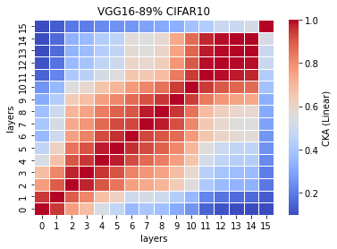
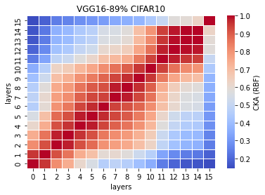

# LTH remove 89% parameters
acc. = [0.1683, 0.1732, 0.1746, 0.1608, 0.1528] mean:0.1659 std: 0.0082

remaining params: 3698843

LTH_train_model6_x
```
6_1
Train loss: 2.302584, Valid loss: 2.302584
Updating model file...
Early stopping at: 11
----------------------------------------------
6_2
Train loss: 2.302584, Valid loss: 2.302584
Updating model file...
Early stopping at: 2
----------------------------------------------
6_3
Train loss: 2.302584, Valid loss: 2.302584
Updating model file...
Early stopping at: 4
----------------------------------------------
6_4
Train loss: 2.302584, Valid loss: 2.302584
Updating model file...
Early stopping at: 12
----------------------------------------------
6_5
Train loss: 2.302584, Valid loss: 2.302584
Updating model file...
Early stopping at: 9
----------------------------------------------
```

LTH_features6_x
```
6_1
Test average loss: 2.3026, acc: 0.1683
----------
6_2
Test average loss: 2.3026, acc: 0.1732
----------
6_3
Test average loss: 2.3026, acc: 0.1746
----------
6_4
Test average loss: 2.3026, acc: 0.1608
----------
6_5
Test average loss: 2.3026, acc: 0.1528
----------
```

CKA Linear avg <br>


CKA RBF avg <br>

