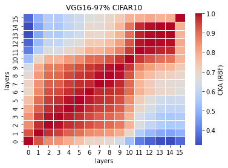

# LTH remove 97%
acc = [0.1000, ] mean:0.1 std:0

time = [51.9772, 51.0201, 52.3322] mean:51.7765 std:0.5541

lr=0.1 

remained: 1008779

LTH_features97_x:
```
Test average loss: 2.3026, acc: 0.1000
Test time: 51.9772 s
----------
Test average loss: 2.3026, acc: 0.1000
Test time: 51.0201 s
----------
Test average loss: 2.3026, acc: 0.1000
Test time: 52.3322 s
----------
```

LTH_train_model97_x:
```

```

linear:


rbf:


