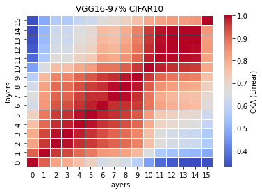

# LTH remove 97%
acc = [0.1000, ] mean: std:

time = [51.9772, ] mean: std:

lr=0.1 

remained: 1008779

LTH_features97_x:
```
Test average loss: 2.3026, acc: 0.1000
Test time: 51.9772 s
----------

```

LTH_train_model97_x:
```

```

linear:



rbf:


