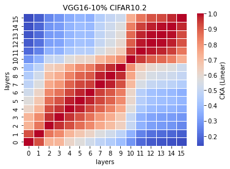
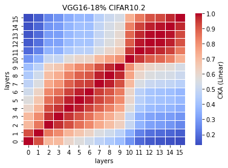
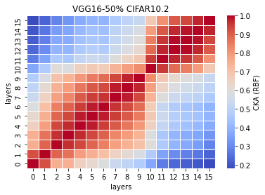
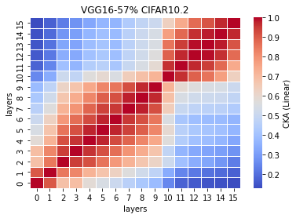

# LTH on OOD test set
**10% **
```
avg acc: 0.5797
std acc: 0.0094
avg time: 10.7165
std time: 0.2872
```
1_x
```
Test average loss: 2.7854, acc: 0.5780
Test time: 10.9201 s
----------
Test average loss: 3.3827, acc: 0.5960
Test time: 10.4518 s
----------
Test average loss: 2.2717, acc: 0.5820
Test time: 11.1132 s
----------
Test average loss: 2.6887, acc: 0.5750
Test time: 10.7576 s
----------
Test average loss: 2.6319, acc: 0.5675
Test time: 10.3397 s
----------
```
linear<br>
<br>
rbf<br>
<br>

**18%**
```
avg acc: 0.5829
std acc: 0.0119
avg time: 10.8200 
std time: 0.2380
```
2_x
```
Test average loss: 2.6916, acc: 0.5875
Test time: 10.9476 s
----------
Test average loss: 2.5623, acc: 0.5710
Test time: 10.6458 s
----------
Test average loss: 2.2451, acc: 0.5720
Test time: 11.2208 s
----------
Test average loss: 2.4468, acc: 0.6035
Test time: 10.7242 s
----------
Test average loss: 2.5669, acc: 0.5805
Test time: 10.5617 s
----------
```
linear<br>
<br>
rbf<br>
<br>

**25%**
```
avg acc: 0.5913
std acc: 0.0065
avg time: 12.1092
std time: 1.5914
```
3_x
```
Test average loss: 2.7859, acc: 0.5860
Test time: 14.5834 s
----------
Test average loss: 2.5018, acc: 0.6025
Test time: 13.3858 s
----------
Test average loss: 2.5309, acc: 0.5940
Test time: 10.9900 s
----------
Test average loss: 2.4334, acc: 0.5895
Test time: 10.4807 s
----------
Test average loss: 2.5243, acc: 0.5845
Test time: 11.1060 s
----------
```
linear<br>
<br>
rbf<br>
<br>

**32%**
```
avg acc: 0.5895
std acc: 0.0062
avg time: 12.6512
std time: 1.7166
```
4_x
```
Test average loss: 2.6281, acc: 0.5955
Test time: 14.3166 s
----------
Test average loss: 2.8037, acc: 0.5940
Test time: 14.8373 s
----------
Test average loss: 2.8538, acc: 0.5860
Test time: 12.5872 s
----------
Test average loss: 2.8453, acc: 0.5790
Test time: 10.7154 s
----------
Test average loss: 2.7593, acc: 0.5930
Test time: 10.7994 s
----------
```
linear<br>
<br>
rbf<br>
<br>

**50% **
```
avg acc: 0.5916
std acc:0.0052
avg time: 12.6694
std time: 1.8232
```
50_x
```
Test average loss: 3.1058, acc: 0.5885
Test time: 14.0000 s
----------
Test average loss: 2.8038, acc: 0.5865
Test time: 15.3494 s
----------
Test average loss: 2.6568, acc: 0.5960
Test time: 12.5708 s
----------
Test average loss: 2.3745, acc: 0.5875
Test time: 10.6616 s
----------
Test average loss: 2.7235, acc: 0.5995
Test time: 10.7650 s
----------
```
linear<br>
<br>
rbf<br>
<br>

**57%**
```
avg acc: 
std acc:
avg time:
std time:
```
57_x
```
Test average loss: 2.6405, acc: 0.5880
Test time: 14.7152 s
----------
Test average loss: 2.8653, acc: 0.5915
Test time: 14.0462 s
----------
Test average loss: 2.4807, acc: 0.5930
Test time: 12.2902 s
----------

```
linear<br>
<br>
rbf<br>
<br>

**59%**
```
avg acc: 
std acc:
avg time:
std time:
```
59_x
```

```
linear<br>
<br>
rbf<br>
<br>

**66%**
```
avg acc: 
std acc:
avg time:
std time:
```

```

```
linear<br>
<br>
rbf<br>
<br>

**75%**
```
avg acc: 
std acc:
avg time:
std time:
```

```

```
linear<br>
<br>
rbf<br>
<br>

**82%**
```
avg acc: 
std acc:
avg time:
std time:
```

```

```
linear<br>
<br>
rbf<br>
<br>

**89%**
```
avg acc: 
std acc:
avg time:
std time:
```

```

```
linear<br>
<br>
rbf<br>
<br>
