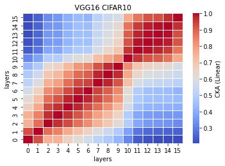
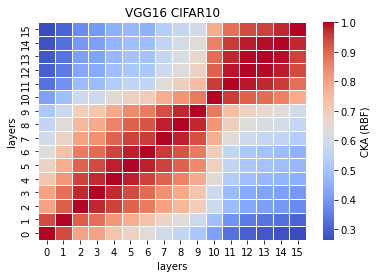
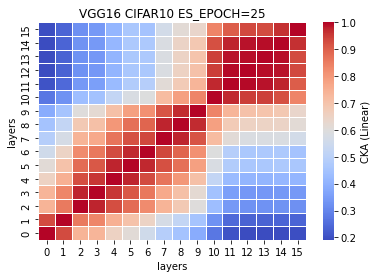
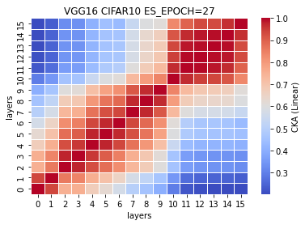
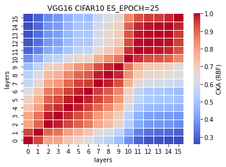
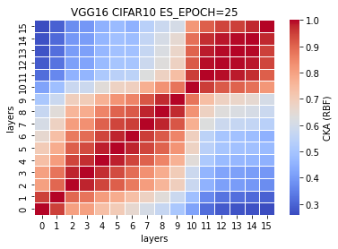
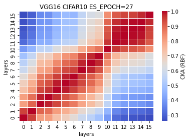

## raw VGG16
model size = 262712kb

5 experiments: [0.7581, 0.7641, 0.7548, 0.7469, 0.7515] mean±std = (0.7551,0.0058)

time: (56.62728, 5.539297155199385)

```
Total params: 33,625,792
Trainable params: 33,625,792
Non-trainable params: 0
----------------------------------------------------------------
Input size (MB): 0.01
Forward/backward pass size (MB): 2.17
Params size (MB): 128.27
Estimated Total Size (MB): 130.46
----------------------------------------------------------------
-data_type=cifar10 -model_type=vgg16 -learning_rate=0.001 -momentum=0.9 -num_epoch=50 -patience=50
```
train_model1_x:
```
1_1
----------------------------------------------
Train loss: 0.688125, Valid loss: 0.835164
Updating model file...
Early stopping at: 24
----------------------------------------------
1_2
Train loss: 0.616438, Valid loss: 0.798078
Updating model file...
Early stopping at: 25
----------------------------------------------
1_3
Train loss: 0.557071, Valid loss: 0.826835
Updating model file...
Early stopping at: 25
----------------------------------------------
1_4
Train loss: 0.594662, Valid loss: 0.805917
Updating model file...
Early stopping at: 25
----------------------------------------------
1_5
Train loss: 0.465813, Valid loss: 0.808837
Updating model file...
Early stopping at: 27
----------------------------------------------
```
features1_x.pt
```
1_1
-mode=test -data_type=cifar10 -model_type=vgg16
Test average loss: 1.6674, acc: 0.7581
Test time: 67.6058 s
----------
1_2
Test average loss: 1.4824, acc: 0.7641
Test time: 54.8417 s
----------

1_3
Test average loss: 1.5527, acc: 0.7548
Test time: 54.2062 s
----------

1_4
Test average loss: 1.4928, acc: 0.7469
Test time: 53.9167 s
----------

1_5
Test average loss: 1.5996, acc: 0.7515
Test time: 52.5660 s
----------
```
CKA Linear plot (averaged over 5 exps):<br>


CKA RBF plot (averaged over 5 exps):<br>


CKA (Linear) plot:<br>
    

CKA (RBF) plot:<br>
    
