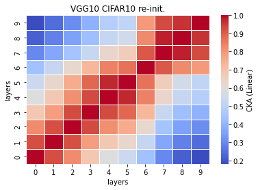
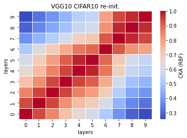

# vgg10 cka reinit
acc = []

time = []

size = 238934kb

recka_features10_x
```
Test average loss: 1.1538, acc: 0.7045
Test time: 37.4442 s
----------
```

recka_train_model10_x
```
Train loss: 0.619860, Valid loss: 0.889382
Updating model file...
Early stopping at: 15
----------------------------------------------
```

linaer:



rbf:


