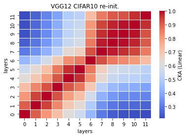
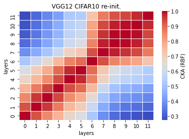

# reinit cka vgg12 
acc = [0.7237,0.6998,0.7104] (0.7113, 0.0098)

time = [34.6780,36.7590,35.7167] (35.7179, 0.8496)

model size = 248310kb

seed = 79, 26, 35

recka_features12_x
```
Test average loss: 1.4340, acc: 0.7237
Test time: 34.6780 s
----------
Test average loss: 1.0045, acc: 0.6998
Test time: 36.7590 s
----------
Test average loss: 1.1282, acc: 0.7104
Test time: 35.7167 s
----------
```

recka_train_model12_x
```
Train loss: 0.528353, Valid loss: 0.862456
Updating model file...
Early stopping at: 17
----------------------------------------------
Train loss: 0.773799, Valid loss: 0.875288
Updating model file...
Early stopping at: 14
----------------------------------------------
Train loss: 0.629794, Valid loss: 0.889764
Updating model file...
Early stopping at: 16
----------------------------------------------
```

linear:



rbf:


