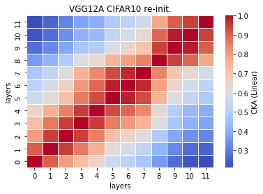
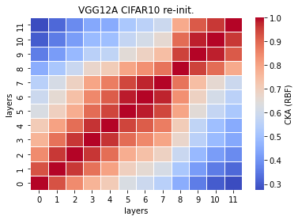

# VGG12a reinit cka
acc = []

time = []

size = 

recka_features12a_x
```
Test average loss: 0.8761, acc: 0.7437
Test time: 38.4738 s
----------
Test average loss: 1.2292, acc: 0.7260
Test time: 37.1513 s
----------
Test average loss: 1.0298, acc: 0.7212
Test time: 37.0034 s
----------
```

recka_train_model12a_x
```
Train loss: 0.626546, Valid loss: 0.799192
Updating model file...
Early stopping at: 17
----------------------------------------------
Train loss: 0.436530, Valid loss: 0.867893
Updating model file...
Early stopping at: 19
----------------------------------------------
Train loss: 0.589949, Valid loss: 0.849377
Updating model file...
Early stopping at: 16
----------------------------------------------
```

linear:



rbf:


