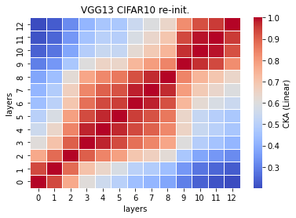
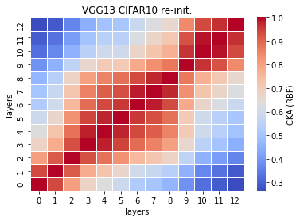

# vgg13 reinint cka
acc = [] 

time = []

size: 187383 kb

recka_features13_x
```
Test average loss: 0.9633, acc: 0.7513
Test time: 50.9912 s
----------
Test average loss: 0.9051, acc: 0.7491
Test time: 42.1828 s
----------
Test average loss: 0.9663, acc: 0.7493
Test time: 40.5916 s
----------
```

recka_train_model13_x
```
Train loss: 0.466659, Valid loss: 0.784110
Updating model file...
Early stopping at: 20
----------------------------------------------
Train loss: 0.470399, Valid loss: 0.734870
Updating model file...
Early stopping at: 21
----------------------------------------------
Train loss: 0.420785, Valid loss: 0.761660
Updating model file...
Early stopping at: 22
----------------------------------------------
```

linear:



rbf:


