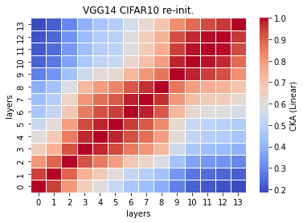
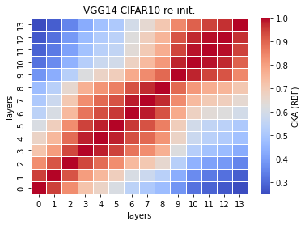

# vgg14 reinint cka
acc = [] 

time = []

size:

recka_features14_x
```
Test average loss: 1.0104, acc: 0.7317
Test time: 41.4312 s
----------

```

recka_train_model14_x
```
Train loss: 0.522985, Valid loss: 0.771862
Updating model file...
Early stopping at: 22
----------------------------------------------

```

linear:



rbf:


