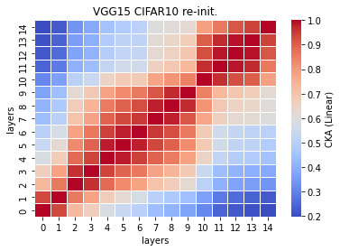
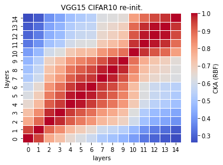

# vgg15 reinint cka
acc = [] 

time = []

size: 197175 kb

recka_features15_x
```
Test average loss: 0.8911, acc: 0.7503
Test time: 57.1729 s
----------
Test average loss: 0.9429, acc: 0.7523
Test time: 55.8004 s
----------

```

recka_train_model15_x
```
Train loss: 0.496376, Valid loss: 0.766288
Updating model file...
Early stopping at: 27
----------------------------------------------
Train loss: 0.495898, Valid loss: 0.746616
Updating model file...
Early stopping at: 29
----------------------------------------------

```

linear:



rbf:


