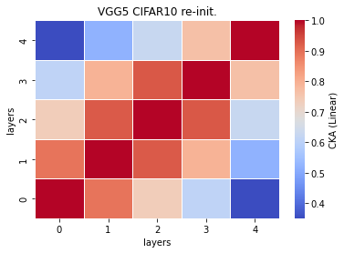
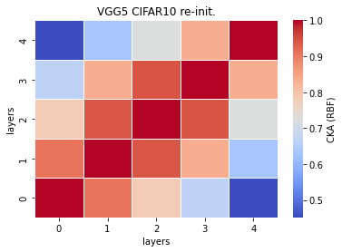

# vgg5 cka reinit
acc = [0.6974,0.7215]

time = [18.9692,19.4521,]

size = 194756 kb

recka_features5_x
```
Test average loss: 1.0158, acc: 0.6974
Test time: 18.9692 s
----------
Test average loss: 0.9549, acc: 0.7215
Test time: 19.4521 s
----------
Test average loss: 0.9456, acc: 0.7173
Test time: 19.5523 s
----------
```

recka_train_model5_x
```
Train loss: 0.613766, Valid loss: 0.875985
Updating model file...
Early stopping at: 13
----------------------------------------------
Train loss: 0.572671, Valid loss: 0.856565
Updating model file...
Early stopping at: 14
----------------------------------------------
Train loss: 0.620783, Valid loss: 0.865848
Updating model file...
Early stopping at: 13
----------------------------------------------
```

linear:



rbf:


