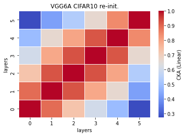
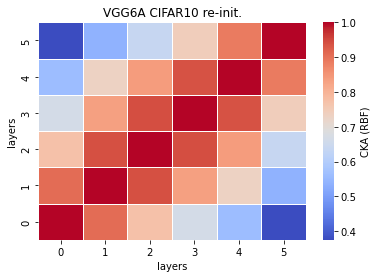

# vgg6a cka reinit
acc = []

time = []

size = 

recka_features6a_x
```
Test average loss: 0.9058, acc: 0.7391
Test time: 22.9575 s
----------
Test average loss: 1.0685, acc: 0.7290
Test time: 22.4779 s
----------
Test average loss: 0.8484, acc: 0.7330
Test time: 22.8402 s
----------
```

recka_train_model6a_x
```
Train loss: 0.556259, Valid loss: 0.815375
Updating model file...
Early stopping at: 13
----------------------------------------------
Train loss: 0.443089, Valid loss: 0.864425
Updating model file...
Early stopping at: 15
----------------------------------------------
Train loss: 0.704914, Valid loss: 0.820710
Updating model file...
Early stopping at: 11
----------------------------------------------
```

linaer:



rbf:


