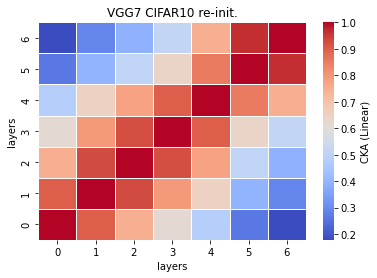

# vgg7 cka reinit
acc = []

time = []

size = 

recka_features7_x
```
Test average loss: 0.9902, acc: 0.7304
Test time: 22.1430 s
----------
Test average loss: 0.9133, acc: 0.7295
Test time: 22.5529 s
----------

```

recka_train_model7_x
```
Train loss: 0.524084, Valid loss: 0.808651
Updating model file...
Early stopping at: 15
----------------------------------------------
----------------------------------------------
Train loss: 0.633101, Valid loss: 0.853770
Updating model file...
Early stopping at: 13
----------------------------------------------

```

linaer:



rbf:


