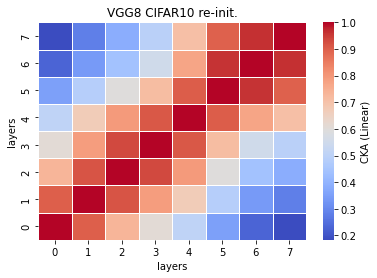

# vgg8 cka reinit
acc = [0.7249,0.7296,0.7151]  (0.7232, 0.0060)

time = [25.5849,24.4897,24.8108]  (24.9618, 0.4597)

size = 229573 kb

recka_features8_x
```
Test average loss: 0.9893, acc: 0.7249
Test time: 25.5849 s
----------
Test average loss: 0.9475, acc: 0.7296
Test time: 24.4897 s
----------
Test average loss: 0.9858, acc: 0.7151
Test time: 24.8108 s
----------
```

recka_train_model8_x
```
Train loss: 0.583869, Valid loss: 0.859877
Updating model file...
Early stopping at: 15
----------------------------------------------
Train loss: 0.654485, Valid loss: 0.844786
Updating model file...
Early stopping at: 14
----------------------------------------------
Train loss: 0.616110, Valid loss: 0.832795
Updating model file...
Early stopping at: 14
----------------------------------------------
```

linaer:



rbf:


