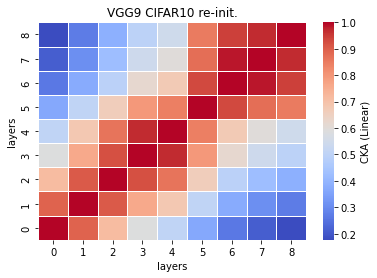
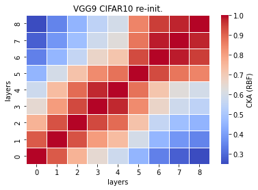

# vgg9 cka reinit
acc = []

time = []

size = 

recka_features9_x
```
Test average loss: 0.9403, acc: 0.7314
Test time: 27.8007 s
----------
```

recka_train_model9_x
```
Train loss: 0.636347, Valid loss: 0.825541
Updating model file...
Early stopping at: 15
----------------------------------------------
```

linaer:



rbf:


