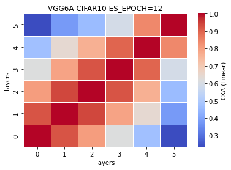

### Ablation 1: remove ~20% params or 10 layers but conv not fc
The removal in this ablation study is not based on the observation of CKA similarity plot, and in fact, we remove the conv layer purely because it is a removable layer, and the architecture will not change even if we remove it. We keep the second fc layer although it is more similar to the adjacent fc layer. <br>
5 exps: [0.7393, 0.7072, 0.7103, 0.7197, 0.7214] (mean,std) = (0.7196, 0.0112)<br>

time: (24.377399999999998, 0.5336417524894387)


Compare with similar number of params: VGG11 (18.0096%, 0.7291, 0.0066), VGG10 (18.1314%, 0.7456, 0.0060), VGG9 (18.2410%, 0.7333, 0.0144). Performance is worse.<br>
Compare with similar number of layers: VGG6 (0.7140, 0.0116). Very similar performance but much more params.
```
----------------------------------------------------------------
        Layer (type)               Output Shape         Param #
================================================================
            Conv2d-1           [-1, 64, 32, 32]           1,728
            Conv2d-2          [-1, 128, 16, 16]          73,728
            Conv2d-3            [-1, 256, 8, 8]         294,912
            Conv2d-4            [-1, 512, 4, 4]       1,179,648
            Linear-5                 [-1, 4096]       8,388,608
            Linear-6                 [-1, 4096]      16,777,216
================================================================
Total params: 26,715,840
Trainable params: 26,715,840
Non-trainable params: 0
----------------------------------------------------------------
Input size (MB): 0.01
Forward/backward pass size (MB): 1.00
Params size (MB): 101.91
Estimated Total Size (MB): 102.92
----------------------------------------------------------------
```
%reduced params = (33638218-26715840)/33638218\*100 = 20.5789% <br>
num. of reduced params = 33638218-26715840 = 6922378
```
        #self.fc1 = nn.Linear(512, 4096, bias=False)
        self.fc1 = nn.Linear(512*2*2, 4096, bias=False)
        self.fc2 = nn.Linear(4096, 4096, bias=False)
        self.fc3 = nn.Linear(4096, 10, bias=False)
        
        
    def forward(self, x):
        
        x1 = self.conv1(x)
        
        #x2 = F.relu(x1)
        #x3 = self.conv2(x2)
        
        x4 = F.relu(x1)
        x5 = F.max_pool2d(x4, kernel_size=2, stride=2)
        x6 = self.conv3(x5)
        
        #x7 = F.relu(x6)
        #x8 = self.conv4(x7)
        
        x9 = F.relu(x6)
        x10 = F.max_pool2d(x9, kernel_size=2, stride=2)
        x11 = self.conv5(x10)
        
        #x12 = F.relu(x11)
        #x13 = self.conv6(x12)
        
        #x14 = F.relu(x13)
        #x15 = self.conv7(x14)
        
        x16 = F.relu(x11)
        x17 = F.max_pool2d(x16, kernel_size=2, stride=2)
        x18 = self.conv8(x17)
        
        #x19 = F.relu(x18)
        #x20 = self.conv9(x19)
        
        #x21 = F.relu(x18)
        #x22 = self.conv10(x21)
        
        #x23 = F.relu(x18)
        #x24 = F.max_pool2d(x23, kernel_size=2, stride=2)
        #x25 = self.conv11(x24)
        
        #x26 = F.relu(x25)
        #x27 = self.conv12(x26)
        
        #x28 = F.relu(x27)
        #x29 = self.conv13(x28)
        
        x30 = F.relu(x18)
        x31 = F.max_pool2d(x30, kernel_size=2, stride=2)
        #print(x31.shape)
        #x32 = torch.reshape(torch.flatten(x31), (-1, 512))
        x32 = x31.view(x31.size(0),-1)
        #print(x32.shape)
        x33 = self.fc1(x32)
        
        x34 = F.relu(x33)
        x35 = self.fc2(x34)
        
        #x36 = F.relu(x35)
        #x37 = self.fc3(x36)
        
        x38 = F.log_softmax(x35, dim=1)
        
        feature_map = [x1, x6, x11, x18, x33, x35]
        
        return (feature_map, x38)
```
train_model10_x
```
10_1
Train loss: 0.619738, Valid loss: 0.851704
Updating model file...
Early stopping at: 12
----------------------------------------------
10_2
Train loss: 0.494347, Valid loss: 0.852588
Updating model file...
Early stopping at: 14
----------------------------------------------
10_3
Train loss: 0.540911, Valid loss: 0.864587
Updating model file...
Early stopping at: 13
----------------------------------------------
10_4
Train loss: 0.496380, Valid loss: 0.864690
Updating model file...
Early stopping at: 14
----------------------------------------------
10_5
Train loss: 0.700456, Valid loss: 0.870713
Updating model file...
Early stopping at: 11
----------------------------------------------
```
features10_x.pt
```
10_1
Test average loss: 1.8064, acc: 0.7393
Test time: 25.1288 s
----------
10_2
Test average loss: 1.1475, acc: 0.7072
Test time: 23.9408 s
----------
10_3
Test average loss: 1.0790, acc: 0.7103
Test time: 24.0626 s
----------
10_4
Test average loss: 1.1483, acc: 0.7197
----------
10_5
Test average loss: 1.0496, acc: 0.7214
----------
```
CKA Linear avg <br>


CKA RBF avg: <br>


CKA (Linear) plot:<br>
    

CKA (RBF) plot:<br>
    
