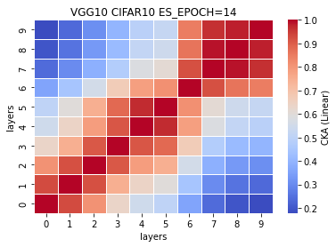
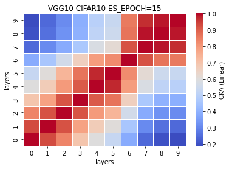
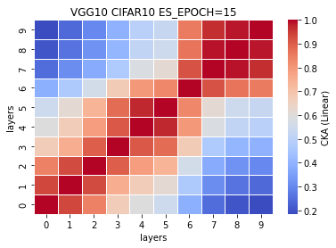
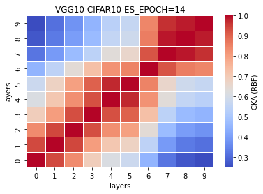
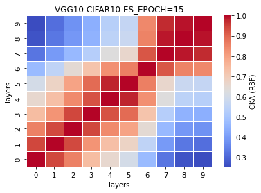

### remove ~18% params or 6 layers (VGG10)
5 exps: [0.7454, 0.7561, 0.7445, 0.7444, 0.7374] mean±std = (0.7456, 0.0060)

time: (35.609166666666674, 0.2613986015434843)

```
Total params: 27,539,136
Trainable params: 27,539,136
Non-trainable params: 0
----------------------------------------------------------------
Input size (MB): 0.01
Forward/backward pass size (MB): 1.59
Params size (MB): 105.05
Estimated Total Size (MB): 106.66
----------------------------------------------------------------
-mode=train -model_type=vgg16_N -data_type=cifar10 -learning_rate=0.001 -momentum=0.9 -num_epoch=50 -patience=50
```
VGG16_N model (VGG10) <br>
%reduced params = (33638218-27539136)/33638218\*100 = 18.1314%<br>
num. of reduced params = 33638218-27539136 = 6099082
```
def forward(self, x):
        
        x1 = self.conv1(x)
        
        x2 = F.relu(x1)
        x3 = self.conv2(x2)
        
        x4 = F.relu(x3)
        x5 = F.max_pool2d(x4, kernel_size=2, stride=2)
        x6 = self.conv3(x5)
        
        #x7 = F.relu(x6)
        #x8 = self.conv4(x7)
        
        x9 = F.relu(x6)
        x10 = F.max_pool2d(x9, kernel_size=2, stride=2)
        x11 = self.conv5(x10)
        
        #x12 = F.relu(x11)
        #x13 = self.conv6(x12)
        
        #x14 = F.relu(x13)
        #x15 = self.conv7(x14)
        
        x16 = F.relu(x11)
        x17 = F.max_pool2d(x16, kernel_size=2, stride=2)
        x18 = self.conv8(x17)
        
        #x19 = F.relu(x18)
        #x20 = self.conv9(x19)
        
        x21 = F.relu(x18)
        x22 = self.conv10(x21)
        
        x23 = F.relu(x22)
        x24 = F.max_pool2d(x23, kernel_size=2, stride=2)
        x25 = self.conv11(x24)
        
        x26 = F.relu(x25)
        x27 = self.conv12(x26)
        
        #x28 = F.relu(x27)
        #x29 = self.conv13(x28)
        
        x30 = F.relu(x27)
        x31 = F.max_pool2d(x30, kernel_size=2, stride=2)
        x32 = torch.reshape(torch.flatten(x31), (-1, 512))
        x33 = self.fc1(x32)
        
        x34 = F.relu(x33)
        x35 = self.fc2(x34)
        
        #x36 = F.relu(x35)
        #x37 = self.fc3(x36)
        
        x38 = F.log_softmax(x35, dim=1)
        
        feature_map = [x1, x3, x6, x11, x18, x22, x25, x27, x33, x35]
        
        return (feature_map, x38)
    # total params: 27,539,136
```
train_model4_x
```
4_1
Train loss: 0.718790, Valid loss: 0.881342
Updating model file...
Early stopping at: 13

4_2
Train loss: 0.674869, Valid loss: 0.852468
Updating model file...
Early stopping at: 14
----------------------------------------------
4_3
Train loss: 0.585402, Valid loss: 0.885301
Updating model file...
Early stopping at: 15
----------------------------------------------
4_4
Train loss: 0.540360, Valid loss: 0.908679
Updating model file...
Early stopping at: 15
----------------------------------------------
4_5
Train loss: 0.640493, Valid loss: 0.906032
Updating model file...
Early stopping at: 14
----------------------------------------------
```
features4_x.pt
```
4_1
Test average loss: 2.2320, acc: 0.7454
Test time: 35.6739 s
----------
4_2
Test average loss: 2.1772, acc: 0.7561
Test time: 35.8920 s
----------
4_3
Test average loss: 2.2484, acc: 0.7445
Test time: 35.2616 s
----------
4_4
Test average loss: 2.2425, acc: 0.7444
----------
4_5
Test average loss: 2.1341, acc: 0.7374
----------
```
avg CKA Linear:<br>


avg CKA RBF: <br>


CKA (Linear) plot:<br>
    

CKA (RBF) plot:<br>
    
