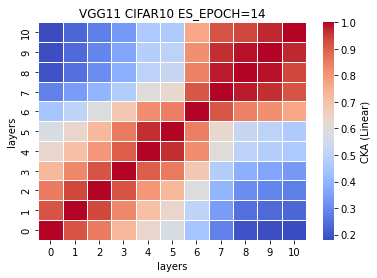
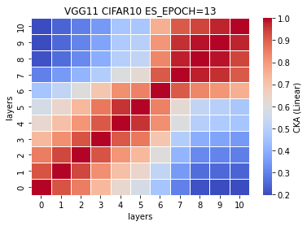
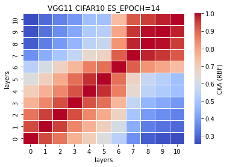

### remove ~18% or 5 conv layers (VGG11)
5 exps: [0.7353, 0.7321, 0.7228, 0.7197, 0.7357] mean±std = (0.7291, 0.0066)
```
Total params: 27,580,096
Trainable params: 27,580,096
Non-trainable params: 0
----------------------------------------------------------------
Input size (MB): 0.01
Forward/backward pass size (MB): 1.59
Params size (MB): 105.21
Estimated Total Size (MB): 106.82
----------------------------------------------------------------
-mode=train -model_type=vgg16_N -data_type=cifar10 -learning_rate=0.001 -momentum=0.9 -num_epoch=50 -patience=50
```
VGG16_N model (VGG11) <br>
%reduced params = (33638218-27580096)/33638218\*100 = 18.0096%<br>
num. of reduced params = 33638218-27580096 = 6058122
```
def forward(self, x):
        
        x1 = self.conv1(x)
        
        x2 = F.relu(x1)
        x3 = self.conv2(x2)
        
        x4 = F.relu(x3)
        x5 = F.max_pool2d(x4, kernel_size=2, stride=2)
        x6 = self.conv3(x5)
        
        #x7 = F.relu(x6)
        #x8 = self.conv4(x7)
        
        x9 = F.relu(x6)
        x10 = F.max_pool2d(x9, kernel_size=2, stride=2)
        x11 = self.conv5(x10)
        
        #x12 = F.relu(x11)
        #x13 = self.conv6(x12)
        
        #x14 = F.relu(x13)
        #x15 = self.conv7(x14)
        
        x16 = F.relu(x11)
        x17 = F.max_pool2d(x16, kernel_size=2, stride=2)
        x18 = self.conv8(x17)
        
        #x19 = F.relu(x18)
        #x20 = self.conv9(x19)
        
        x21 = F.relu(x18)
        x22 = self.conv10(x21)
        
        x23 = F.relu(x22)
        x24 = F.max_pool2d(x23, kernel_size=2, stride=2)
        x25 = self.conv11(x24)
        
        x26 = F.relu(x25)
        x27 = self.conv12(x26)
        
        #x28 = F.relu(x27)
        #x29 = self.conv13(x28)
        
        x30 = F.relu(x27)
        x31 = F.max_pool2d(x30, kernel_size=2, stride=2)
        x32 = torch.reshape(torch.flatten(x31), (-1, 512))
        x33 = self.fc1(x32)
        
        x34 = F.relu(x33)
        x35 = self.fc2(x34)
        
        x36 = F.relu(x35)
        x37 = self.fc3(x36)
        
        x38 = F.log_softmax(x37, dim=1)
        
        feature_map = [x1, x3, x6, x11, x18, x22, x25, x27, x33, x35, x37]
        
        return (feature_map, x38)
    # total params: 27,580,096
```
train_model3_x
```
3_1
Train loss: 0.606346, Valid loss: 0.950074
Updating model file...
Early stopping at: 14

3_2
Train loss: 0.719542, Valid loss: 0.891522
Updating model file...
Early stopping at: 13
----------------------------------------------
3_3
Train loss: 0.699429, Valid loss: 0.932371
Updating model file...
Early stopping at: 13
----------------------------------------------
3_4
Train loss: 0.632378, Valid loss: 0.927835
Updating model file...
Early stopping at: 14
----------------------------------------------
3_5
Train loss: 0.715451, Valid loss: 0.886982
Updating model file...
Early stopping at: 13
----------------------------------------------
```
features3_x.pt
```
3_1
Test average loss: 2.2414, acc: 0.7353

3_2
Test average loss: 2.4621, acc: 0.7321
----------

3_3
Test average loss: 2.1219, acc: 0.7228
----------

3_4
Test average loss: 2.2657, acc: 0.7197
----------
3_5
Test average loss: 2.2702, acc: 0.7357
----------
```
CKA Linear avg:<br>


CKA RBF avg:<br>


CKA (Linear) plot:<br>
    

CKA (RBF) plot:<br>
    
