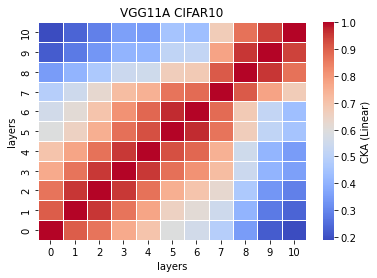
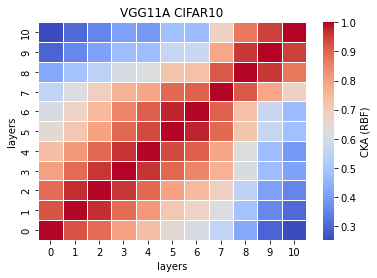

# vgg11a remove 1 fc and 4 convs
acc. = [0.7126, 0.7037, 0.7006, 0.7038, 0.7024] mean:0.7046 std:0.0042

remained: 11392704/33638218\*100 = 33.8683339289%

removed: 66.13166607101%
```
Total params: 11,392,704
Trainable params: 11,392,704
Non-trainable params: 0
----------------------------------------------------------------
Input size (MB): 0.01
Forward/backward pass size (MB): 1.69
Params size (MB): 43.46
Estimated Total Size (MB): 45.16
----------------------------------------------------------------
```

train_model16_x
```
16_1
Train loss: 0.693018, Valid loss: 0.937255
Updating model file...
Early stopping at: 14
----------------------------------------------
16_2
Train loss: 0.620268, Valid loss: 0.918675
Updating model file...
Early stopping at: 15
----------------------------------------------
16_3
Train loss: 0.472890, Valid loss: 0.952541
Updating model file...
Early stopping at: 17
----------------------------------------------
16_4
Train loss: 0.704132, Valid loss: 0.917469
Updating model file...
Early stopping at: 14
----------------------------------------------
16_5
Train loss: 0.606559, Valid loss: 0.922661
Updating model file...
Early stopping at: 15
----------------------------------------------
```

features16_x
```
16_1
Test average loss: 1.2255, acc: 0.7126
----------
16_2
Test average loss: 1.3809, acc: 0.7037
----------
16_3
Test average loss: 1.2947, acc: 0.7006
----------
16_4
Test average loss: 1.2698, acc: 0.7038
----------
16_5
Test average loss: 1.4216, acc: 0.7024
----------
```

CKA linear avg <br>


CKA RBF avg<br>


```
def forward(self, x):
        
        x1 = self.conv1(x)
        
        x2 = F.relu(x1)
        x3 = self.conv2(x2)
        
        x4 = F.relu(x3)
        x5 = F.max_pool2d(x4, kernel_size=2, stride=2)
        x6 = self.conv3(x5)
        
        #x7 = F.relu(x6)
        #x8 = self.conv4(x7)
        
        x9 = F.relu(x6)
        x10 = F.max_pool2d(x9, kernel_size=2, stride=2)
        x11 = self.conv5(x10)
        
        #x12 = F.relu(x11)
        #x13 = self.conv6(x12)
        
        x14 = F.relu(x11)
        x15 = self.conv7(x14)
        
        x16 = F.relu(x15)
        x17 = F.max_pool2d(x16, kernel_size=2, stride=2)
        x18 = self.conv8(x17)
        
        #x19 = F.relu(x18)
        #x20 = self.conv9(x19)
        
        x21 = F.relu(x18)
        x22 = self.conv10(x21)
        
        x23 = F.relu(x22)
        x24 = F.max_pool2d(x23, kernel_size=2, stride=2)
        x25 = self.conv11(x24)
        
        #x26 = F.relu(x25)
        #x27 = self.conv12(x26)
        
        x28 = F.relu(x25)
        x29 = self.conv13(x28)
        
        x30 = F.relu(x29)
        x31 = F.max_pool2d(x30, kernel_size=2, stride=2)
        x32 = torch.reshape(torch.flatten(x31), (-1, 512))
        x33 = self.fc1(x32)
        
        #x34 = F.relu(x33)
        #x35 = self.fc2(x34)
        
        x36 = F.relu(x33)
        x37 = self.fc3(x36)
        
        x38 = F.log_softmax(x37, dim=1)
        
        feature_map = [x1, x3, x6, x11, x15, x18, x22, x25, x29, x33, x37]
        
        return (feature_map, x38)
```
