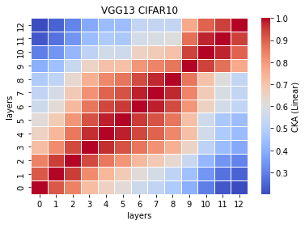
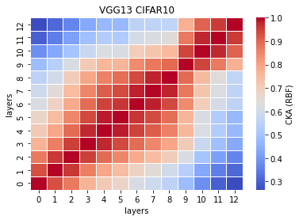

# VGG13 remove 1 fc and 2 convs
acc. = [0.7225, 0.7011, 0.7207, 0.7197, 0.7382] mean:0.7204 std:0.0118 

removed: 57.36449534% <br>
remained: 14341824/33638218\*100 = 42.635504651%
```
Total params: 14,341,824
Trainable params: 14,341,824
Non-trainable params: 0
----------------------------------------------------------------
Input size (MB): 0.01
Forward/backward pass size (MB): 1.88
Params size (MB): 54.71
Estimated Total Size (MB): 56.60
----------------------------------------------------------------
```

train_model13_x
```
13_1
Train loss: 0.571584, Valid loss: 0.851048
Updating model file...
Early stopping at: 19
----------------------------------------------
13_2
Train loss: 0.499687, Valid loss: 0.823276
Updating model file...
Early stopping at: 20
----------------------------------------------
13_3
Train loss: 0.699587, Valid loss: 0.827521
Updating model file...
Early stopping at: 17
----------------------------------------------
13_4
Train loss: 0.492583, Valid loss: 0.827246
Updating model file...
Early stopping at: 20
----------------------------------------------
13_5
Train loss: 0.583303, Valid loss: 0.839197
Updating model file...
Early stopping at: 19
----------------------------------------------
```

features13_x
```
13_1
Test average loss: 0.9961, acc: 0.7225
----------
13_2
Test average loss: 1.1228, acc: 0.7011
----------
13_3
Test average loss: 0.9760, acc: 0.7207
----------
13_4
Test average loss: 1.1620, acc: 0.7197
----------
13_5
Test average loss: 0.9560, acc: 0.7382
----------
```

CKA Linear avg: <br>


CKA RBF avg: <br>


```
def forward(self, x):
        
        x1 = self.conv1(x)
        
        x2 = F.relu(x1)
        x3 = self.conv2(x2)
        
        x4 = F.relu(x3)
        x5 = F.max_pool2d(x4, kernel_size=2, stride=2)
        x6 = self.conv3(x5)
        
        #x7 = F.relu(x6)
        #x8 = self.conv4(x7)
        
        x9 = F.relu(x6)
        x10 = F.max_pool2d(x9, kernel_size=2, stride=2)
        x11 = self.conv5(x10)
        
        x12 = F.relu(x11)
        x13 = self.conv6(x12)
        
        x14 = F.relu(x13)
        x15 = self.conv7(x14)
        
        x16 = F.relu(x15)
        x17 = F.max_pool2d(x16, kernel_size=2, stride=2)
        x18 = self.conv8(x17)
        
        x19 = F.relu(x18)
        x20 = self.conv9(x19)
        
        x21 = F.relu(x20)
        x22 = self.conv10(x21)
        
        x23 = F.relu(x22)
        x24 = F.max_pool2d(x23, kernel_size=2, stride=2)
        x25 = self.conv11(x24)
        
        x26 = F.relu(x25)
        x27 = self.conv12(x26)
        
        #x28 = F.relu(x27)
        #x29 = self.conv13(x28)
        
        x30 = F.relu(x27)
        x31 = F.max_pool2d(x30, kernel_size=2, stride=2)
        x32 = torch.reshape(torch.flatten(x31), (-1, 512))
        x33 = self.fc1(x32)
        
        #x34 = F.relu(x33)
        #x35 = self.fc2(x34)
        
        x36 = F.relu(x33)
        x37 = self.fc3(x36)
        
        x38 = F.log_softmax(x37, dim=1)
        
        feature_map = [x1, x3, x6, x11, x13, x15, x18, x20, x22, x25, x27, x33, x37]
        
        return (feature_map, x38)
```
