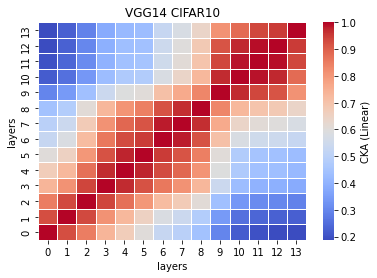
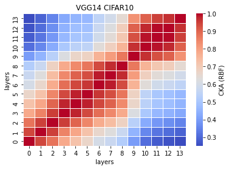

# vgg14 remove 1 conv 1 fc
acc. = [0.7416, 0.7235, 0.7386, 0.7238, 0.7298] mean:0.7315 std: 0.0075

reduced: (33638218-16701120)/33638218 * 100 = 50.35076%
remain: 49.6492%
```
Total params: 16,701,120
Trainable params: 16,701,120
Non-trainable params: 0
----------------------------------------------------------------
Input size (MB): 0.01
Forward/backward pass size (MB): 1.89
Params size (MB): 63.71
Estimated Total Size (MB): 65.61
----------------------------------------------------------------
```

train_model12_x:
```
12_1
Train loss: 0.537619, Valid loss: 0.827904
Updating model file...
Early stopping at: 22
----------------------------------------------
12_2
Train loss: 0.507968, Valid loss: 0.824071
Updating model file...
Early stopping at: 23
----------------------------------------------
12_3
Train loss: 0.726933, Valid loss: 0.803296
Updating model file...
Early stopping at: 19
----------------------------------------------
12_4
Train loss: 0.570383, Valid loss: 0.828118
Updating model file...
Early stopping at: 22
----------------------------------------------
12_5
Train loss: 0.535410, Valid loss: 0.841385
Updating model file...
Early stopping at: 22
----------------------------------------------
```

features12_x.pt:
```
12_1
Test average loss: 1.0942, acc: 0.7416
----------
12_2
Test average loss: 1.1265, acc: 0.7235
----------
12_3
Test average loss: 0.9765, acc: 0.7386
----------
12_4
Test average loss: 0.9601, acc: 0.7238
----------
12_5
Test average loss: 0.9999, acc: 0.7298
----------
```

CKA Linear avg:<br>


CKA RBF avg: <br>


```
def forward(self, x):
        
        x1 = self.conv1(x)
        
        x2 = F.relu(x1)
        x3 = self.conv2(x2)
        
        x4 = F.relu(x3)
        x5 = F.max_pool2d(x4, kernel_size=2, stride=2)
        x6 = self.conv3(x5)
        
        #x7 = F.relu(x6)
        #x8 = self.conv4(x7)
        
        x9 = F.relu(x6)
        x10 = F.max_pool2d(x9, kernel_size=2, stride=2)
        x11 = self.conv5(x10)
        
        x12 = F.relu(x11)
        x13 = self.conv6(x12)
        
        x14 = F.relu(x13)
        x15 = self.conv7(x14)
        
        x16 = F.relu(x15)
        x17 = F.max_pool2d(x16, kernel_size=2, stride=2)
        x18 = self.conv8(x17)
        
        x19 = F.relu(x18)
        x20 = self.conv9(x19)
        
        x21 = F.relu(x20)
        x22 = self.conv10(x21)
        
        x23 = F.relu(x22)
        x24 = F.max_pool2d(x23, kernel_size=2, stride=2)
        x25 = self.conv11(x24)
        
        x26 = F.relu(x25)
        x27 = self.conv12(x26)
        
        x28 = F.relu(x27)
        x29 = self.conv13(x28)
        
        x30 = F.relu(x29)
        x31 = F.max_pool2d(x30, kernel_size=2, stride=2)
        x32 = torch.reshape(torch.flatten(x31), (-1, 512))
        x33 = self.fc1(x32)
        
        #x34 = F.relu(x33)
        #x35 = self.fc2(x34)
        
        x36 = F.relu(x33)
        x37 = self.fc3(x36)
        
        x38 = F.log_softmax(x37, dim=1)
        
        feature_map = [x1, x3, x6, x11, x13, x15, x18, x20, x22, x25, x27, x29, x33, x37]
        
        return (feature_map, x38)
```
