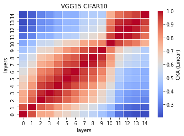
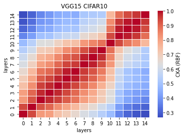

# VGG15 remove 1 fc layer (~50% params)
acc. = [0.7474, 0.7176, 0.7286, 0.7115, 0.7267] mean:0.7264 std: 0.0122

```
Total params: 16,848,576
Trainable params: 16,848,576
Non-trainable params: 0
----------------------------------------------------------------
Input size (MB): 0.01
Forward/backward pass size (MB): 2.14
Params size (MB): 64.27
Estimated Total Size (MB): 66.42
----------------------------------------------------------------
```
remained params: 16848576/33638218\*100 = 50.087599%

removed: 49.9124%

model detail:
```
def forward(self, x):
        
        x1 = self.conv1(x)
        
        x2 = F.relu(x1)
        x3 = self.conv2(x2)
        
        x4 = F.relu(x3)
        x5 = F.max_pool2d(x4, kernel_size=2, stride=2)
        x6 = self.conv3(x5)
        
        x7 = F.relu(x6)
        x8 = self.conv4(x7)
        
        x9 = F.relu(x8)
        x10 = F.max_pool2d(x9, kernel_size=2, stride=2)
        x11 = self.conv5(x10)
        
        x12 = F.relu(x11)
        x13 = self.conv6(x12)
        
        x14 = F.relu(x13)
        x15 = self.conv7(x14)
        
        x16 = F.relu(x15)
        x17 = F.max_pool2d(x16, kernel_size=2, stride=2)
        x18 = self.conv8(x17)
        
        x19 = F.relu(x18)
        x20 = self.conv9(x19)
        
        x21 = F.relu(x20)
        x22 = self.conv10(x21)
        
        x23 = F.relu(x22)
        x24 = F.max_pool2d(x23, kernel_size=2, stride=2)
        x25 = self.conv11(x24)
        
        x26 = F.relu(x25)
        x27 = self.conv12(x26)
        
        x28 = F.relu(x27)
        x29 = self.conv13(x28)
        
        x30 = F.relu(x29)
        x31 = F.max_pool2d(x30, kernel_size=2, stride=2)
        x32 = torch.reshape(torch.flatten(x31), (-1, 512))
        x33 = self.fc1(x32)
        
        #x34 = F.relu(x33)
        #x35 = self.fc2(x34)
        
        x36 = F.relu(x33)
        x37 = self.fc3(x36)
        
        x38 = F.log_softmax(x37, dim=1)
        
        feature_map = [x1, x3, x6, x8, x11, x13, x15, x18, x20, x22, x25, x27, x29, x33, x37]
        
        return (feature_map, x38)
```

train_model11_x
```
11_1
Train loss: 0.516391, Valid loss: 0.832608
Updating model file...
Early stopping at: 24
----------------------------------------------
11_2
Train loss: 0.614235, Valid loss: 0.825426
Updating model file...
Early stopping at: 23
----------------------------------------------
11_3
Train loss: 0.531199, Valid loss: 0.869985
Updating model file...
Early stopping at: 24
----------------------------------------------
11_4
Train loss: 0.632276, Valid loss: 0.916156
Updating model file...
Early stopping at: 22
----------------------------------------------
11_5
Train loss: 0.551990, Valid loss: 0.846146
Updating model file...
Early stopping at: 24
----------------------------------------------
```

features11_x
```
11_1
Test average loss: 1.4277, acc: 0.7474
----------
11_2
Test average loss: 1.1595, acc: 0.7176
----------
11_3
Test average loss: 1.2788, acc: 0.7286
----------
11_4
Test average loss: 1.3094, acc: 0.7115
----------
11_5
Test average loss: 1.2872, acc: 0.7267
----------
```

CKA linear avg: <br>


CKA RBF avg:<br>

