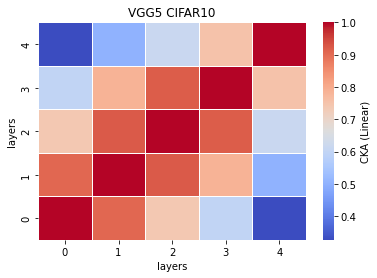
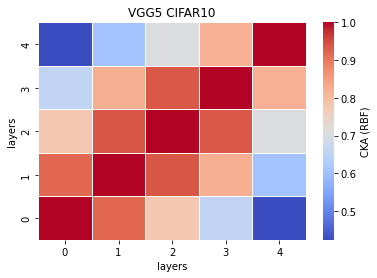
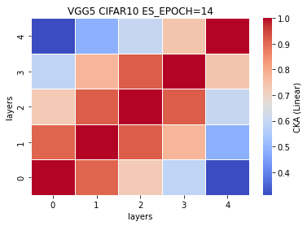
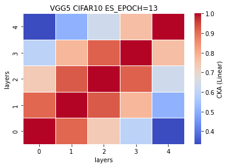
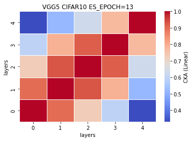
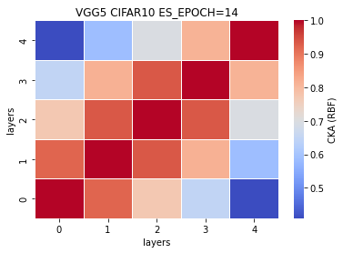
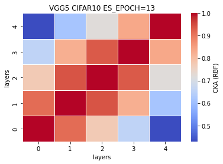

### reaching the limit: remove 89% or 11 layers (VGG5)
[0.7319, 0.7204, 0.7176, 0.7198, 0.7166] mean±std = (0.7213, 0.0055)
```
Total params: 3,647,168
Trainable params: 3,647,168
Non-trainable params: 0
----------------------------------------------------------------
Input size (MB): 0.01
Forward/backward pass size (MB): 0.97
Params size (MB): 13.91
Estimated Total Size (MB): 14.89
----------------------------------------------------------------
```
%reduced params = (33638218-3647168)/33638218\*100 = 89.1577% <br>
num. of reduced params = 33638218-3647168 = 29991050
```
        #self.fc1 = nn.Linear(512, 4096, bias=False)
        self.fc1 = nn.Linear(512*2*2, 4096, bias=False)
        self.fc2 = nn.Linear(4096, 4096, bias=False)
        self.fc3 = nn.Linear(4096, 10, bias=False)
        
        
    def forward(self, x):
        
        x1 = self.conv1(x)
        
        #x2 = F.relu(x1)
        #x3 = self.conv2(x2)
        
        x4 = F.relu(x1)
        x5 = F.max_pool2d(x4, kernel_size=2, stride=2)
        x6 = self.conv3(x5)
        
        #x7 = F.relu(x6)
        #x8 = self.conv4(x7)
        
        x9 = F.relu(x6)
        x10 = F.max_pool2d(x9, kernel_size=2, stride=2)
        x11 = self.conv5(x10)
        
        #x12 = F.relu(x11)
        #x13 = self.conv6(x12)
        
        #x14 = F.relu(x13)
        #x15 = self.conv7(x14)
        
        x16 = F.relu(x11)
        x17 = F.max_pool2d(x16, kernel_size=2, stride=2)
        x18 = self.conv8(x17)
        
        #x19 = F.relu(x18)
        #x20 = self.conv9(x19)
        
        #x21 = F.relu(x18)
        #x22 = self.conv10(x21)
        
        #x23 = F.relu(x18)
        #x24 = F.max_pool2d(x23, kernel_size=2, stride=2)
        #x25 = self.conv11(x24)
        
        #x26 = F.relu(x25)
        #x27 = self.conv12(x26)
        
        #x28 = F.relu(x27)
        #x29 = self.conv13(x28)
        
        x30 = F.relu(x18)
        x31 = F.max_pool2d(x30, kernel_size=2, stride=2)
        #print(x31.shape)
        x32 = x31.view(x31.size(0),-1)
        #x32 = torch.reshape(torch.flatten(x31), (-1, 512))
        #print(x32.shape)
        x33 = self.fc1(x32)
        
        #x34 = F.relu(x33)
        #x35 = self.fc2(x34)
        
        #x36 = F.relu(x35)
        #x37 = self.fc3(x36)
        
        x38 = F.log_softmax(x33, dim=1)
        
        feature_map = [x1, x6, x11, x18, x33]
        
        return (feature_map, x38)
    # total params: 3,647,168
```
train_model9_x
```
9_1
Train loss: 0.583674, Valid loss: 0.839788
Updating model file...
Early stopping at: 14

9_2
Train loss: 0.578305, Valid loss: 0.871138
Updating model file...
Early stopping at: 14
----------------------------------------------
9_3
Train loss: 0.608685, Valid loss: 0.863399
Updating model file...
Early stopping at: 13
----------------------------------------------
9_4
Train loss: 0.638563, Valid loss: 0.856784
Updating model file...
Early stopping at: 13
----------------------------------------------
9_5
Train loss: 0.521172, Valid loss: 0.846765
Updating model file...
Early stopping at: 15
----------------------------------------------
```
features9_x.pt
```
9_1
Test average loss: 1.6781, acc: 0.7319

9_2
Test average loss: 0.9899, acc: 0.7204
----------
9_3
Test average loss: 0.9833, acc: 0.7176
----------
9_4
Test average loss: 0.9790, acc: 0.7198
----------
9_5
Test average loss: 1.0242, acc: 0.7166
----------
```
CKA Linear avg: <br>


CKA RBF avg: <br>


CKA (Linear) plot:<br>
    

CKA (RBF) plot:<br>
    
