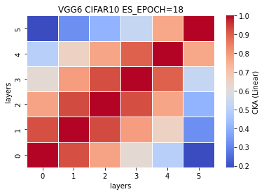
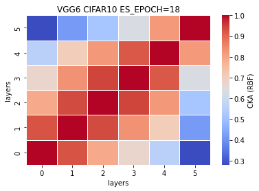
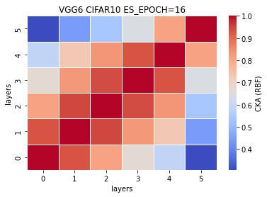

### remove ~82% or 10 layers (VGG6)
[0.7350, 0.7016, 0.7109, 0.7164, 0.7063] mean±std = (0.7140, 0.0116)
```
Total params: 6,006,464
Trainable params: 6,006,464
Non-trainable params: 0
----------------------------------------------------------------
Input size (MB): 0.01
Forward/backward pass size (MB): 0.98
Params size (MB): 22.91
Estimated Total Size (MB): 23.91
----------------------------------------------------------------
```
%reduced params = (33638218-6006464)/33638218\*100 = 82.1439% <br>
num. of reduced params = 33638218-6006464 = 27631754
```
def forward(self, x):
        
        x1 = self.conv1(x)
        
        #x2 = F.relu(x1)
        #x3 = self.conv2(x2)
        
        x4 = F.relu(x1)
        x5 = F.max_pool2d(x4, kernel_size=2, stride=2)
        x6 = self.conv3(x5)
        
        #x7 = F.relu(x6)
        #x8 = self.conv4(x7)
        
        x9 = F.relu(x6)
        x10 = F.max_pool2d(x9, kernel_size=2, stride=2)
        x11 = self.conv5(x10)
        
        #x12 = F.relu(x11)
        #x13 = self.conv6(x12)
        
        #x14 = F.relu(x13)
        #x15 = self.conv7(x14)
        
        x16 = F.relu(x11)
        x17 = F.max_pool2d(x16, kernel_size=2, stride=2)
        x18 = self.conv8(x17)
        
        #x19 = F.relu(x18)
        #x20 = self.conv9(x19)
        
        #x21 = F.relu(x18)
        #x22 = self.conv10(x21)
        
        x23 = F.relu(x18)
        x24 = F.max_pool2d(x23, kernel_size=2, stride=2)
        x25 = self.conv11(x24)
        
        #x26 = F.relu(x25)
        #x27 = self.conv12(x26)
        
        #x28 = F.relu(x27)
        #x29 = self.conv13(x28)
        
        x30 = F.relu(x25)
        x31 = F.max_pool2d(x30, kernel_size=2, stride=2)
        x32 = torch.reshape(torch.flatten(x31), (-1, 512))
        x33 = self.fc1(x32)
        
        #x34 = F.relu(x33)
        #x35 = self.fc2(x34)
        
        #x36 = F.relu(x35)
        #x37 = self.fc3(x36)
        
        x38 = F.log_softmax(x33, dim=1)
        
        feature_map = [x1, x6, x11, x18, x25, x33]
        
        return (feature_map, x38)
    # total params: 6,006,464
```
train_model8_x
```
8_1
Train loss: 0.398895, Valid loss: 0.858886
Updating model file...
Early stopping at: 18

8_2
Train loss: 0.420581, Valid loss: 0.861237
Updating model file...
Early stopping at: 18
----------------------------------------------
8_3
Train loss: 0.539408, Valid loss: 0.863718
Updating model file...
Early stopping at: 16
----------------------------------------------
8_4
Train loss: 0.429075, Valid loss: 0.893893
Updating model file...
Early stopping at: 18
----------------------------------------------
8_5
Train loss: 0.532771, Valid loss: 0.851450
Updating model file...
Early stopping at: 16
----------------------------------------------
```
features8_x.pt
```
8_1
Test average loss: 1.8300, acc: 0.7350

8_2
Test average loss: 0.9925, acc: 0.7016
----------
8_3
Test average loss: 0.9710, acc: 0.7109
----------
8_4
Test average loss: 0.9749, acc: 0.7164
----------
8_5
Test average loss: 0.9998, acc: 0.7063
----------
```
CKA (Linear) plot:<br>
    

CKA (RBF) plot:<br>
    

