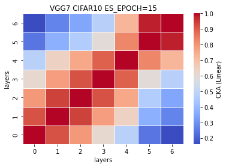

### remove ~32% or 9 layers (VGG7)
[0.7422, 0.7183, 0.7112, 0.7285, 0.7141] mean±std = (0.7229, 0.0113)

time: (23.53986666666667, 0.24279514456064044)

```
Total params: 22,783,680
Trainable params: 22,783,680
Non-trainable params: 0
----------------------------------------------------------------
Input size (MB): 0.01
Forward/backward pass size (MB): 1.02
Params size (MB): 86.91
Estimated Total Size (MB): 87.94
----------------------------------------------------------------
```
%reduced params = (33638218-22783680)/33638218\*100 = 32.2685% <br>
num. of reduced params = 33638218-22783680 = 10854538
```
def forward(self, x):
        
        x1 = self.conv1(x)
        
        #x2 = F.relu(x1)
        #x3 = self.conv2(x2)
        
        x4 = F.relu(x1)
        x5 = F.max_pool2d(x4, kernel_size=2, stride=2)
        x6 = self.conv3(x5)
        
        #x7 = F.relu(x6)
        #x8 = self.conv4(x7)
        
        x9 = F.relu(x6)
        x10 = F.max_pool2d(x9, kernel_size=2, stride=2)
        x11 = self.conv5(x10)
        
        #x12 = F.relu(x11)
        #x13 = self.conv6(x12)
        
        #x14 = F.relu(x13)
        #x15 = self.conv7(x14)
        
        x16 = F.relu(x11)
        x17 = F.max_pool2d(x16, kernel_size=2, stride=2)
        x18 = self.conv8(x17)
        
        #x19 = F.relu(x18)
        #x20 = self.conv9(x19)
        
        #x21 = F.relu(x18)
        #x22 = self.conv10(x21)
        
        x23 = F.relu(x18)
        x24 = F.max_pool2d(x23, kernel_size=2, stride=2)
        x25 = self.conv11(x24)
        
        #x26 = F.relu(x25)
        #x27 = self.conv12(x26)
        
        #x28 = F.relu(x27)
        #x29 = self.conv13(x28)
        
        x30 = F.relu(x25)
        x31 = F.max_pool2d(x30, kernel_size=2, stride=2)
        x32 = torch.reshape(torch.flatten(x31), (-1, 512))
        x33 = self.fc1(x32)
        
        x34 = F.relu(x33)
        x35 = self.fc2(x34)
        
        #x36 = F.relu(x35)
        #x37 = self.fc3(x36)
        
        x38 = F.log_softmax(x35, dim=1)
        
        feature_map = [x1, x6, x11, x18, x25, x33, x35]
        
        return (feature_map, x38)
    # total params: 22,783,680
```
train_model7_x
```
7_1
Train loss: 0.522085, Valid loss: 0.880628
Updating model file...
Early stopping at: 15

7_2
Train loss: 0.555697, Valid loss: 0.842057
Updating model file...
Early stopping at: 15
----------------------------------------------
7_3
Train loss: 0.488027, Valid loss: 0.868555
Updating model file...
Early stopping at: 16
----------------------------------------------
7_4
Train loss: 0.398970, Valid loss: 0.861331
Updating model file...
Early stopping at: 17
----------------------------------------------
7_5
Train loss: 0.354991, Valid loss: 0.878753
Updating model file...
Early stopping at: 18
----------------------------------------------
```
features7_x.pt
```
7_1
Test average loss: 1.8591, acc: 0.7422
Test time: 23.8435 s
----------
7_2
Test average loss: 1.0358, acc: 0.7183
Test time: 23.5269 s
----------
7_3
Test average loss: 1.0422, acc: 0.7112
Test time: 23.2492 s
----------
7_4
Test average loss: 1.0087, acc: 0.7285
----------
7_5
Test average loss: 1.0733, acc: 0.7141
----------
```
CKA Linear plot (averaged over 5 exps): <br>


CKA RBF plot (averaged over 5 exps): <br>


CKA (Linear) plot:<br>
    

CKA (RBF) plot:<br>
    
