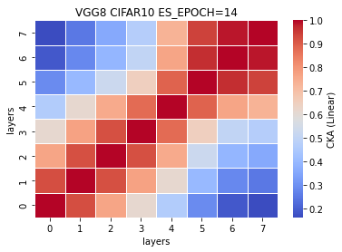
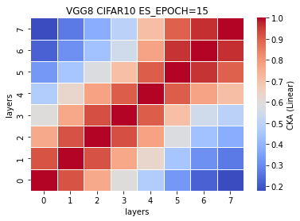
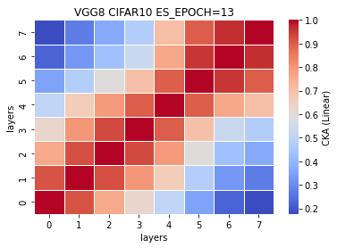
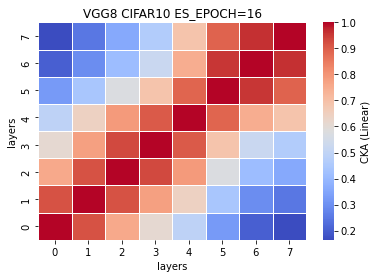
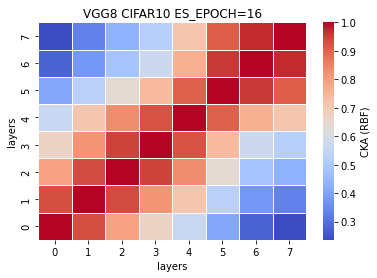

### remove ~25% or 8 layers (VGG8)
5 exps: [0.7421, 0.7161, 0.7034, 0.7281, 0.7191] mean±std = (0.7218, 0.0129)
```
Total params: 25,142,976
Trainable params: 25,142,976
Non-trainable params: 0
----------------------------------------------------------------
Input size (MB): 0.01
Forward/backward pass size (MB): 1.03
Params size (MB): 95.91
Estimated Total Size (MB): 96.96
----------------------------------------------------------------
```
%reduced params = (33638218-25142976)/33638218\*100 = 25.2547% <br>
num. of reduced params = 33638218-25142976 = 8495242
```
def forward(self, x):
        
        x1 = self.conv1(x)
        
        #x2 = F.relu(x1)
        #x3 = self.conv2(x2)
        
        x4 = F.relu(x1)
        x5 = F.max_pool2d(x4, kernel_size=2, stride=2)
        x6 = self.conv3(x5)
        
        #x7 = F.relu(x6)
        #x8 = self.conv4(x7)
        
        x9 = F.relu(x6)
        x10 = F.max_pool2d(x9, kernel_size=2, stride=2)
        x11 = self.conv5(x10)
        
        #x12 = F.relu(x11)
        #x13 = self.conv6(x12)
        
        #x14 = F.relu(x13)
        #x15 = self.conv7(x14)
        
        x16 = F.relu(x11)
        x17 = F.max_pool2d(x16, kernel_size=2, stride=2)
        x18 = self.conv8(x17)
        
        #x19 = F.relu(x18)
        #x20 = self.conv9(x19)
        
        #x21 = F.relu(x18)
        #x22 = self.conv10(x21)
        
        x23 = F.relu(x18)
        x24 = F.max_pool2d(x23, kernel_size=2, stride=2)
        x25 = self.conv11(x24)
        
        x26 = F.relu(x25)
        x27 = self.conv12(x26)
        
        #x28 = F.relu(x27)
        #x29 = self.conv13(x28)
        
        x30 = F.relu(x27)
        x31 = F.max_pool2d(x30, kernel_size=2, stride=2)
        x32 = torch.reshape(torch.flatten(x31), (-1, 512))
        x33 = self.fc1(x32)
        
        x34 = F.relu(x33)
        x35 = self.fc2(x34)
        
        #x36 = F.relu(x35)
        #x37 = self.fc3(x36)
        
        x38 = F.log_softmax(x35, dim=1)
        
        feature_map = [x1, x6, x11, x18, x25, x27, x33, x35]
        
        return (feature_map, x38)
    # total params: 25,142,976
```
train_model6_x
```
6_1
Train loss: 0.660711, Valid loss: 0.851595
Updating model file...
Early stopping at: 14

6_2
Train loss: 0.602200, Valid loss: 0.863321
Updating model file...
Early stopping at: 15
----------------------------------------------
6_3
Train loss: 0.687117, Valid loss: 0.874917
Updating model file...
Early stopping at: 14
----------------------------------------------
6_4
Train loss: 0.715518, Valid loss: 0.859828
Updating model file...
Early stopping at: 13
----------------------------------------------
6_5
Train loss: 0.567657, Valid loss: 0.848754
Updating model file...
Early stopping at: 16
----------------------------------------------
```
features6_x.py
```
6_1
Test average loss: 2.1356, acc: 0.7421

6_2
Test average loss: 1.0195, acc: 0.7161
----------
6_3
Test average loss: 1.0824, acc: 0.7034
----------
6_4
Test average loss: 0.9548, acc: 0.7281
----------
6_5
Test average loss: 0.9945, acc: 0.7191
----------
```
CKA Linear plot (averaged over 5 exps):<br>


CKA RBF plot (averaged over 5 exps): <br>


CKA (Linear) plot:<br>
    

CKA (RBF) plot:<br>
    
