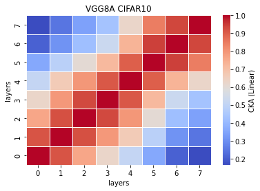
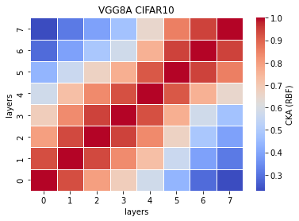

# vgg8a remove 1 fc and 7 convs
acc. = [0.7218, 0.7168, ] mean: std:

remained: 8406720/33638218\*100 = 24.9915735%<br>
removed: 75.00842642%
```
Total params: 8,406,720
Trainable params: 8,406,720
Non-trainable params: 0
----------------------------------------------------------------
Input size (MB): 0.01
Forward/backward pass size (MB): 1.00
Params size (MB): 32.07
Estimated Total Size (MB): 33.08
----------------------------------------------------------------
```

train_model15_x
```
15_1
Train loss: 0.497500, Valid loss: 0.868706
Updating model file...
Early stopping at: 15
----------------------------------------------
15_2
Train loss: 0.556707, Valid loss: 0.855371
Updating model file...
Early stopping at: 15
----------------------------------------------
15_3
Train loss: 0.565502, Valid loss: 0.846999
Updating model file...
Early stopping at: 15
----------------------------------------------
15_4
Train loss: 0.601560, Valid loss: 0.877084
Updating model file...
Early stopping at: 14
----------------------------------------------
15_5

```

features15_x
```
15_1
Test average loss: 1.1293, acc: 0.7218
----------
15_2
Test average loss: 1.2084, acc: 0.7168
----------
15_3
Test average loss: 1.0347, acc: 0.7101
----------
15_4
Test average loss: 0.9343, acc: 0.7234
----------
15_5

```

CKA Linear avg:<br>


CKA RBF avg: <br>


```
def forward(self, x):
        
        x1 = self.conv1(x)
        
        #x2 = F.relu(x1)
        #x3 = self.conv2(x2)
        
        x4 = F.relu(x1)
        x5 = F.max_pool2d(x4, kernel_size=2, stride=2)
        x6 = self.conv3(x5)
        
        #x7 = F.relu(x6)
        #x8 = self.conv4(x7)
        
        x9 = F.relu(x6)
        x10 = F.max_pool2d(x9, kernel_size=2, stride=2)
        x11 = self.conv5(x10)
        
        #x12 = F.relu(x11)
        #x13 = self.conv6(x12)
        
        #x14 = F.relu(x11)
        #x15 = self.conv7(x14)
        
        x16 = F.relu(x11)
        x17 = F.max_pool2d(x16, kernel_size=2, stride=2)
        x18 = self.conv8(x17)
        
        #x19 = F.relu(x18)
        #x20 = self.conv9(x19)
        
        #x21 = F.relu(x20)
        #x22 = self.conv10(x21)
        
        x23 = F.relu(x18)
        x24 = F.max_pool2d(x23, kernel_size=2, stride=2)
        x25 = self.conv11(x24)
        
        x26 = F.relu(x25)
        x27 = self.conv12(x26)
        
        #x28 = F.relu(x27)
        #x29 = self.conv13(x28)
        
        x30 = F.relu(x27)
        x31 = F.max_pool2d(x30, kernel_size=2, stride=2)
        x32 = torch.reshape(torch.flatten(x31), (-1, 512))
        x33 = self.fc1(x32)
        
        #x34 = F.relu(x33)
        #x35 = self.fc2(x34)
        
        x36 = F.relu(x33)
        x37 = self.fc3(x36)
        
        x38 = F.log_softmax(x37, dim=1)
        
        feature_map = [x1, x6, x11, x18, x25, x27, x33, x37]
        
        return (feature_map, x38)
```
